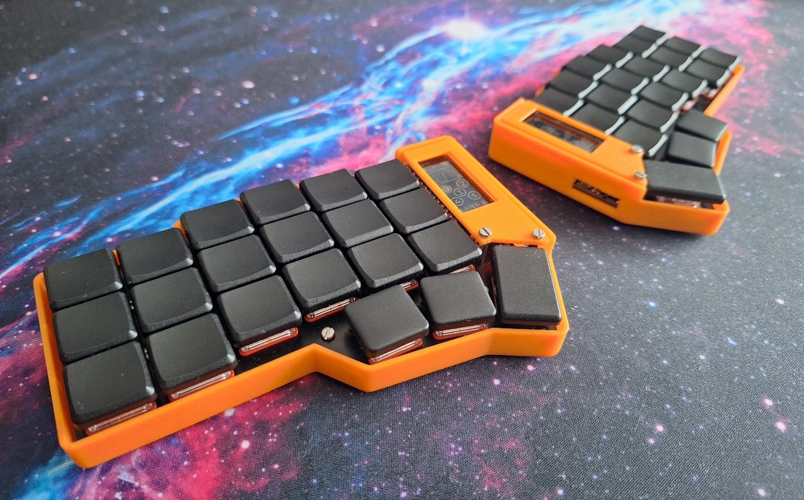
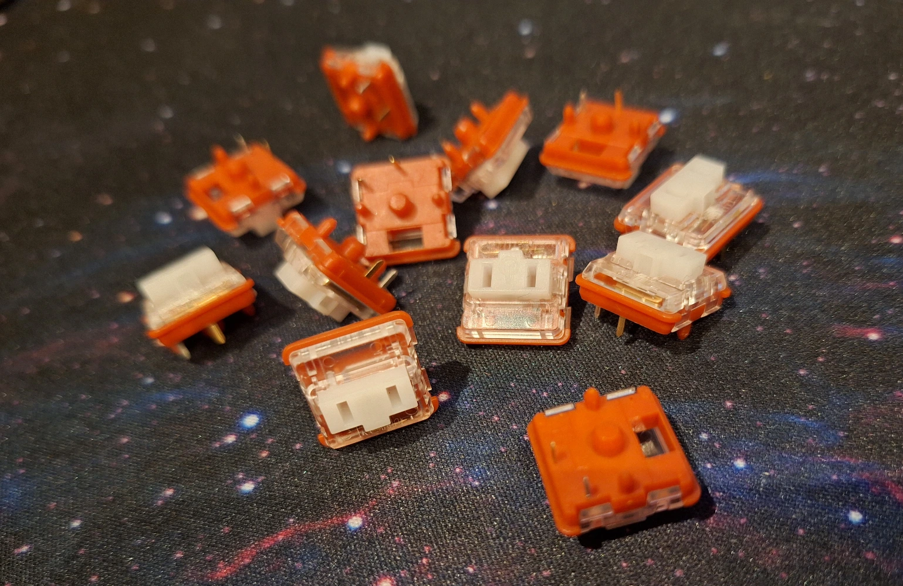
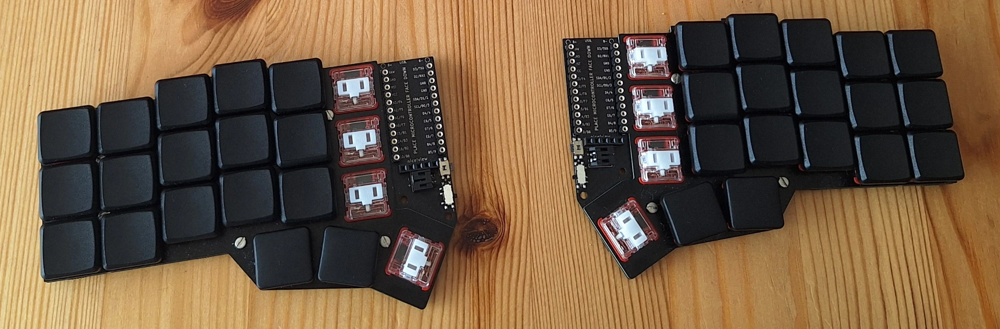
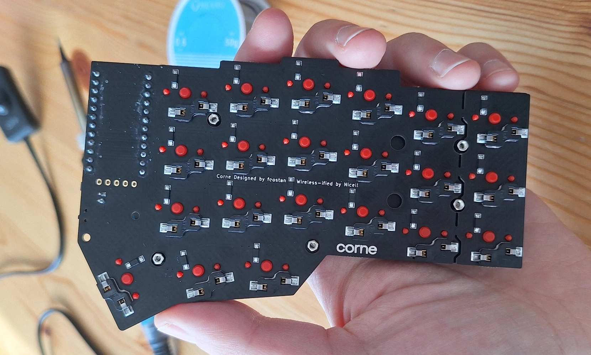
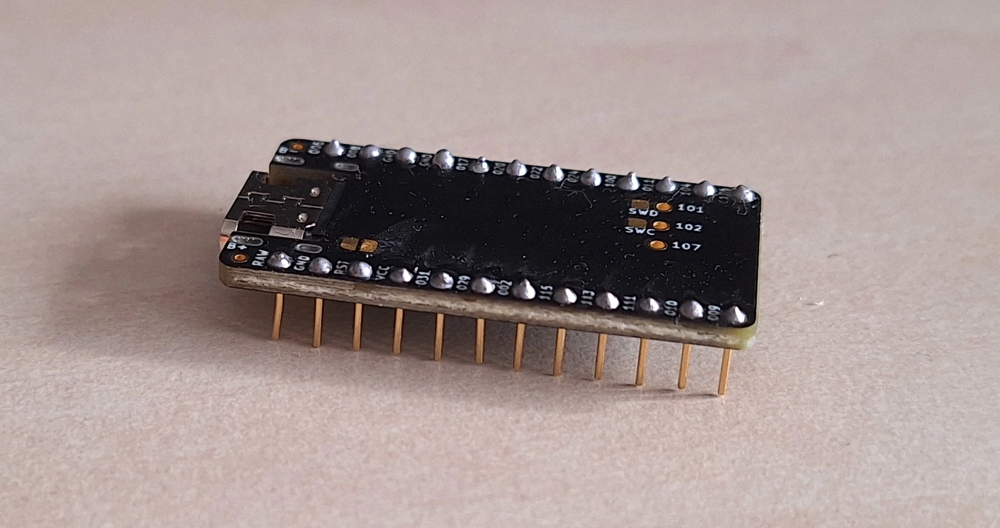
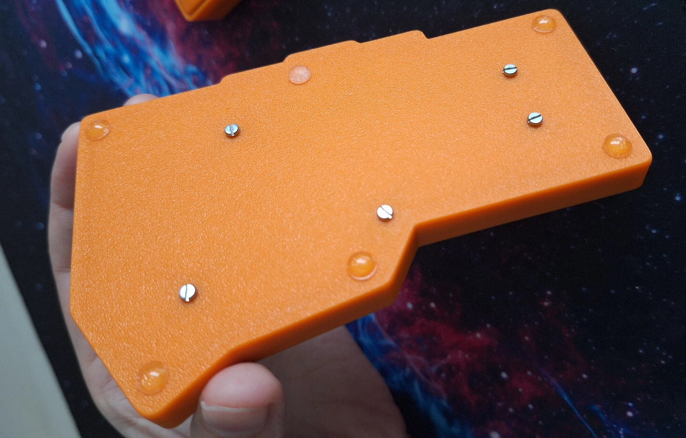
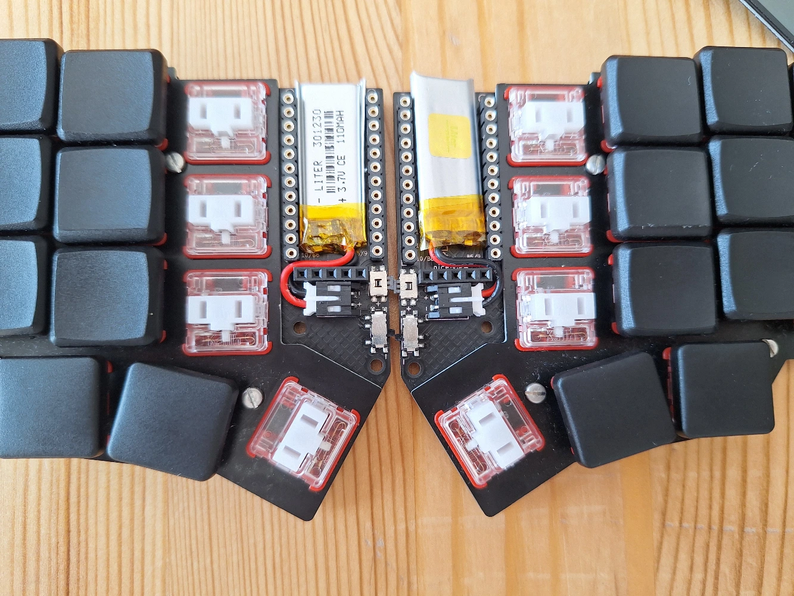
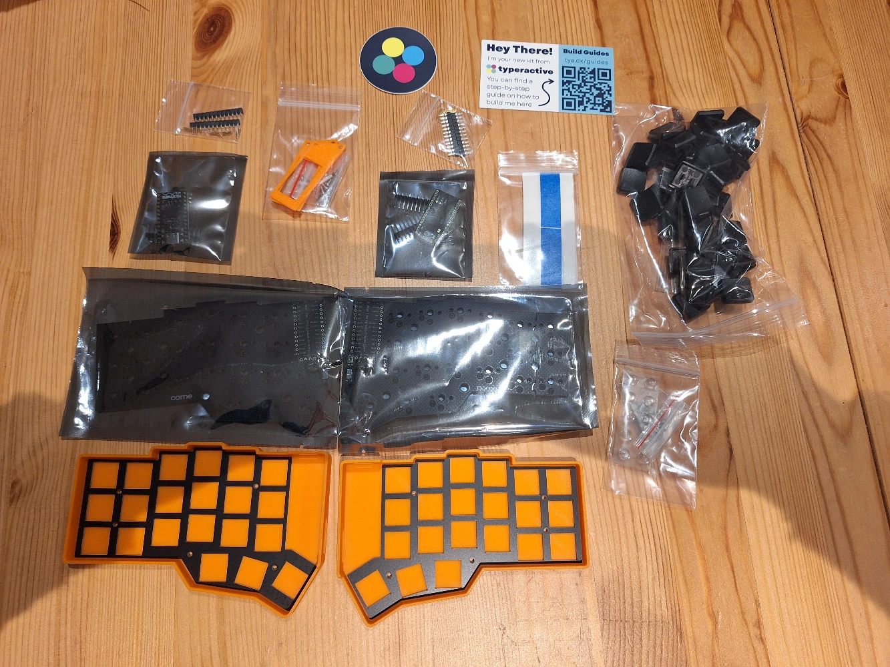
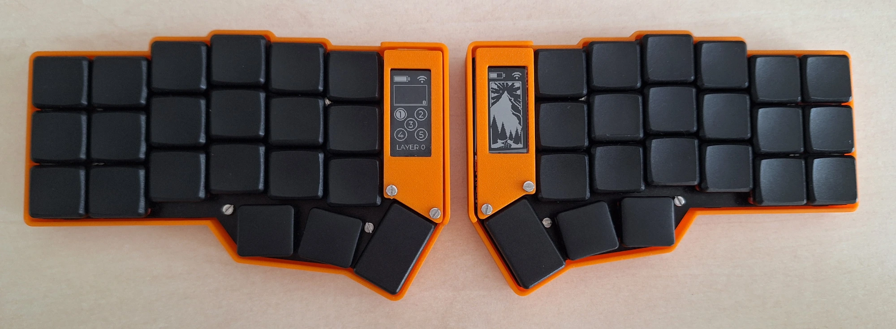

+++
title = "Fabrication d’un clavier ergonomique"
date = 2024-11-02T19:12:55+01:00
author = "trilowy"
tags = ["clavier", "split", "corne", "fabrication"]
+++

Je suis partie d’aucune connaissance en clavier ergonomique (j’avais le bon gros
clavier « 100 % » avec pavé numérique, les touches de fonctions, etc) à un petit
clavier ergonomique : le **Corne**.

Je te raconte ici mon voyage initiatique dans le monde des claviers en espérant
que ça puisse t’aider à te lancer à ton tour 🙂.

<!--more-->

Anatomie d’un clavier
--------------------------------------------------------------------------------

Apprenons à connaitre la bête !

Il existe 2 types de clavier :

- les claviers à membranes
- les claviers mécaniques

Les *claviers à membranes* représentent la très grosse majorité des claviers car
peu cher à produire. Si tu ne sais pas de quel type est ton clavier, c’est
sûrement un clavier à membrane.

On va s’intéresser ici aux *claviers mécaniques* car ils permettent une
fabrication « artisanale ». Chaque pièce peut être remplacée, mais ils coûtent
plus cher à produire. La fourchette de prix démarre dans la 60 aine d’euros et
peut monter à plusieurs centaines d’euros !

Mais grâce à la modularité des claviers mécaniques, chaque touche peut être
arrangée différemment, et on va donc trouver une très grande variété de claviers
**ergonomiques** mécaniques.

### Les touches

Commençons par les pièces les plus intéressantes du clavier mécaniques : les
**touches**, bien souvent appelées <i lang="en">key switches</i>.

Ici aussi, on va essentiellement retrouver 2 sortes de switches :

- les Choc
- les MX

Ces switches diffèrent par leur empreinte sur le <i lang="en">PCB</i> et pour
les <i lang="en">keycaps</i> (on va voir plus tard ce que c’est).

Ce qu’il faut retenir, c’est que seul Kailh produit des Chocs, mais ceux-ci ont
*profil plus bas* (<i lang="en">low-profile</i>, les touches sont moins hautes)
que les MX. En revanche les MX sont plus faciles à trouver et moins chers.

Hormis ce choix entre Choc et MX, 2 autres critères très importants sont à
prendre en compte : le « touché » et la force d’activation.

Ce que j’appelle « touché » peut être de 3 sortes :

- **tactile** : appuyer sur la touche fait un petit « bump », comme les claviers
de PC portable
- **linéaire** : appuyer sur la touche se fait de manière linéaire comme son nom
l’indique, pas de résistance différente jusqu’à ce qu’on arrive en bout de
course
- **clicky** : comme pour le tactile mais avec en plus un petit « clic » sonore
à chaque activation de touche, qui a fait la réputation des claviers mécaniques
comme clavier non approprié pour un environnement de travail 😅

Pour ce qui est de la force d’activation, elle est notée en grammes, c’est le
poids qu’il faut mettre sur la touche pour enfoncer le ressort à l’intérieur et
ainsi l’activer. Plus c’est léger plus la touche sera facile à activer,
augmentant la sensation d’ergonomie, mais moins on pourra laisser reposer ses
doigts sur le claviers sans activer les-dites touches. Les switches légers
demandent un certain temps d’adaptation.

### Les capuchons

Les capuchons ou <i lang="en">keycaps</i> sont ce qui couvre les touches, sur
lesquels les doigts reposent et où il est noté les lettres de la touche.

La seule contrainte est qu’il faut qu’ils soient compatibles avec les switches.

Il en existe avec différents profils (la façon dont ils sont sculptés) plus ou
moins hauts.

Ils peuvent être « <i lang="en">blank</i> » (rien n’est écrit dessus, il faut
savoir écrire à l’aveugle).

Les types « <i lang="en">homing</i> » ont un relief pour permettre de placer au
toucher les 2 index de la main en position dactylo.

Pour les touches des pouces ils peuvent être convexes pour ne pas avoir d’arête
gênante sur le bord.

Avoir différentes largeurs : 1 U étant le carré de référence, 2 U sera un 
capuchon rectangulaire de 2 unités de long par 1 unité de large.

### Le PCB

Le circuit imprimé ou PCB (<i lang="en">Printed Circuit Board</i>) est la partie
permettant de relier tous les composants du clavier entre eux, un peu comme la
carte mère d’un PC.

Le PCB est directement responsable de la géométrie que va prendre le clavier,
c’est donc à choisir avec soin. Pour un clavier « <i lang="en">split</i> »
(c’est-à-dire séparé en 2 parties main gauche/main droite), on aura donc 2 PCB.

L’arrangement des touches va dépendre du PCB. Sur un clavier classique on va
avoir ce qu’on appelle un « <i lang="en">row stagger</i> », c’est-à-dire un
décalage des touches entre les différentes lignes qui fait qu’elles ne sont pas
alignées en colonne pour chaque doigt sur le clavier. L’auriculaire n’a pas un
mouvement de simple repli/extension pour <kbd>A</kbd>, <kbd>Q</kbd> et
<kbd>W</kbd>, il doit aussi décaler de manière horizontale. Ceci est une
contrainte héritée des machines à écrire mais n’est pas souhaitable en
ergonomie.

Au contraire du row stagger, on va plutôt rencontrer du « <i lang="en">column
stagger</i> » sur les claviers ergonomiques : ce column stagger permet de
prendre en compte le fait que tous les doigts n’ont pas la même longueur. En
particulier on va parler de « <i lang="en">pinky stagger</i> » plus ou moins
important pour désigner le décalage de la colonne de touches dédiées aux
auriculaires.

D’autres claviers sont ortholinéaires, ils ont leur disposition de touches en
grille.

Le PCB influence directement le nombre de touches sur le clavier. Un clavier
avec moins de touches coûtera mathématiquement moins cher en composants qu’un
ayant plus de touches. Mais ce n’est pas la seule raison pour laquelle les gens
se tournent vers ces petits claviers : mettre à portée de doigts toutes les
touches améliore grandement le confort de frappe, et c’est aussi là un fondement
de la philosophie de la disposition Ergo‑L. Et pour faire rentrer toutes les
touches dont on a besoin au quotidien (même les touches fonctions ou un pavé
numérique !) on peut profiter du fait que ces claviers qu’on va fabriquer sont
programmables (j’y reviendrai par la suite).

Une dernière remarque par rapport aux PCB, c’est que leur compatibilité n’est
pas garantie avec tous les types de switches : Choc a de plus petites touches
que MX, un PCB Choc va parfois avoir les touches plus rapprochées les unes des
autres, donc des switches MX ou capuchons MX ne rentreront pas. Les pattes des
switches MX et Choc sont différentes (on parle d’empreintes différentes), même
si certains PCB ont des trous pour accepter des switches MX ou Choc, mais dans
ce cas on parlera donc de « <i lang="en">MX spacing</i> » plutôt que
« <i lang="en">Choc spacing</i> », c’est-à-dire qu’il y aura un peu de « jour »
entre les keycaps Choc sur ce genre de PCB.

Aussi, les switches peuvent être directement soudés sur le PCB, mais dans ce cas
il est très difficile d’en changer : à réserver pour les personnes sachant
exactement les switches qu’elles veulent. L’alternative étant des
« <i lang="en">hotswaps</i> », c’est des petits composants soudés au PCB
permettant de clipser les switches sans devoir souder les switches. Les hotswaps
sont, de fait, différents entre MX et Choc.

On peut tester différentes géométries populaires de clavier par rapport à nos
mains sur [ce comparateur][comparateur de géométrie clavier], bien qu’il ne soit
plus mis à jour avec les modèles récents.

### Le MCU

Le MCU (<i lang="en">microcontroller</i>, pas le Marvel Cinematic Universe 😁)
est le cerveau du clavier. Grâce à cette puce on va pouvoir programmer ce qu’on
envoie à l’ordinateur lorqu’une ou plusieurs touches sont pressées.

Il est parfois remplacé par des composants directement soudés sur le PCB.

Le MCU se « <i lang="en">flash</i> » avec un « <i lang="en">firmware</i> »,
c’est-à-dire qu’on va y déposer un programme pour qu’il puisse envoyer des codes
de touches en fonction des touches que l’on presse réellement.

Dans le cas d’un clavier split, il s’occupe aussi de réconcilier ce qui se passe
sur les 2 moitiés (si on appuie sur Shift d’une main et une lettre de l’autre,
on veut que les 2 touches pressées soient bien envoyées en même temps pour faire
une majuscule).

Pour un clavier filaire il est courant d’utiliser [QMK], mais il en existe
d’autres comme [Via] ou [Vial] qui se veulent plus faciles à configurer.

Pour un clavier Bluetooth, seul [ZMK] est possible, et ne permet pas dans sa
version officielle, à l’heure actuelle, d’émuler les mouvements de souris avec
le clavier. Un éditeur visuel pour ZMK est disponible à
[cette adresse][keymap-editor pour ZMK] et a toutes les fonctionnalités de base
pour bien débuter. Par contre pour builder un firmware il faudra un projet
Github.

Pour jouer avec la programmation d’un clavier non programmable que t’as déjà
sous les doigts (et voir si c’est fait pour toi ce genre de clavier), jette un
œil à [arsenik] !

### Les accessoires

Les claviers viennent avec d’autres composants facultatifs. Par exemple des
écrans (comme les nice!view) pour voir l’état de connexion Bluetooth, le niveau
de batterie, etc.

Un cable TRRS pour connecter les 2 moitiés d’un split filaire.

Des LED pour avoir de belles illuminations (attention ça consomme trop de
batterie pour être mis sur un clavier sur batterie).

Une « <i lang="en">case</i> » qui est le boitier du clavier. Souvent imprimé en
3D, mais certaines peuvent être en aluminium. 

Les batteries pour les claviers sans fil. Pour ce tout petit modèle de 110 mAh
qui se glisse sous mon MCU la charge se fait en USB‑C via le nice!nano. La
moitié gauche du clavier (qui sert de receveur de la moitié droite, ce qui est
très consommateur de batterie) dure environ 1 semaine à pleine charge, et la
moitié droite (qui fait juste de l’envoi, peu consommateur) environ 1 mois, les
2 ayant les écrans nice!view à alimenter.

Le « <i lang="en">tenting</i> », le fait d’incliner les 2 moitiés de clavier sur
un angle plus naturel pour les mains peut se faire avec des accessoires plus ou
moins officiellement prévus pour ça (par exemple, on peut détourner de leur but
originel les supports de téléphone type « MagSafe »).

Mon clavier : Corne sans fil
--------------------------------------------------------------------------------

Le [Corne] est filaire à la base, mais [Typeractive] (créateur des nice!nano et
nice!view) en a fait une version sans fil non libre.

Leur configurateur est simple à utiliser pour les personnes qui débutent. On
peut choisir les couleurs et les accessoires. Leur site est basé aux USA
(attention TVA à prévoir à l’importation car elle n’est pas collectée sur leur
site vendeur). Leur Discord permet de poser des questions et d’obtenir du
support (en anglais par contre).

Les hotswaps et les diodes pour les switches sont déjà soudés, il ne reste qu’à
souder les hotswaps pour les MCU et écrans, mais il existe une version
<i lang="en">no-solder</i> de ces hotswaps pour ne pas avoir à sortir de fer à
souder.

J’ai pris un kit pour un Corne en 3x6+3 touches, avec écrans. Pour les switches
Choc Red Pro j’ai pris sur Aliexpress en même temps que les batteries. Le tout
m’est revenu à 260 €, livraison et TVA comprise.

Pour plus d’informations sur mon clavier je t’invite à faire un tour sur le
[#showroom-claviers] du serveur [Discord Ergo‑L]. On parle beaucoup « clavier »
là-bas, tu y trouveras certainement réponse à tes questions.

Le mot de la fin
--------------------------------------------------------------------------------

Merci d’avoir tout lu pour arriver jusqu’ici (et coucou à toi qui a tout zappé
pour arriver à une conclusion qui résume tout ce long article, mais il n’y en a
pas, va falloir tout lire si tu veux les info 😅).

N’hésite pas à proposer des corrections sur le [Github] si besoin.

[comparateur de géométrie clavier]: https://jhelvy.shinyapps.io/splitkbcompare/
[QMK]: https://qmk.fm/
[Vial]: https://get.vial.today/
[Via]: https://www.caniusevia.com/
[ZMK]: https://zmk.dev/
[keymap-editor pour ZMK]: https://nickcoutsos.github.io/keymap-editor/
[arsenik]: https://github.com/OneDeadKey/arsenik
[Corne]: https://github.com/foostan/crkbd
[Typeractive]: https://typeractive.xyz
[#showroom-claviers]: https://discord.com/channels/1046720208171175946/1259963199852380290/1259963199852380290
[Discord Ergo‑L]: https://discord.com/invite/5xR5K3nAFX
[Github]: https://github.com/Nuclear-Squid/ergol