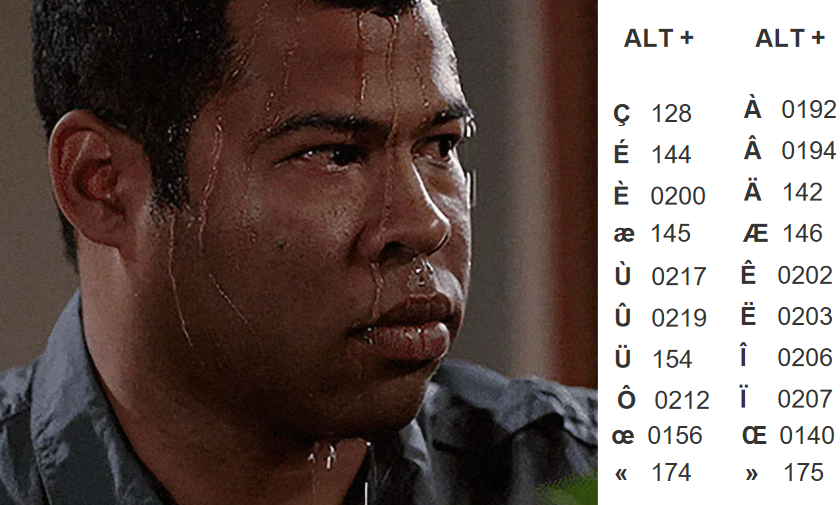
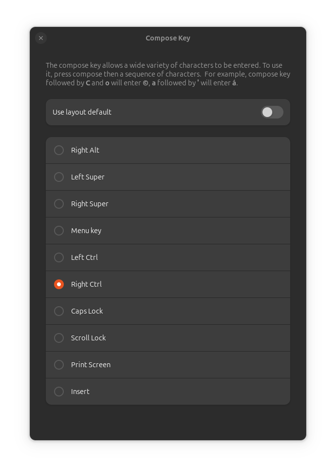

+++
title = "Faire un caractère spécial avec Ergo‑L"
date = 2024-12-29T16:16:16+01:00
author = "cætera"
tags = ["communauté", "tutoriel", "compose"]
+++

« Comment faire le caractère 🔠 (lire un caractère ésotérique qui n’est utilisé
que 3 fois dans sa vie) en [Ergo‑L](/articles/ergol_1_0_0/) ?! » est une
question qui revient fréquemment sur les internets.

<!--more-->

Ce n’est pas toujours simple de répondre, étant donné la multitude de caractères
présents dans Unicode. Cela dépend fortement du caractère en question. 

Petite pensée aux windowsiens **et** typographes exigeants ; cela ne fait pas
bon mélange avec la configuration par défaut…



Chez les Ergonautes on a une autre façon de résoudre le problème…

Les caractères utiles pour écrire une langue parlée en Europe
--------------------------------------------------------------------------------
Bonne nouvelle : si vous écrivez en français, anglais ou toute autre langue
européenne courante, il y a fort a parier que vous besoins sont couverts ! Il
faut simplement savoir où le trouver… Si le caractère n’est pas visible sur
l’image présente sur la [page d’accueil](/) du site d’Ergo‑L, il est peut-être
quand même disponible.


> **NB :** Les caractères en vert sont obtenus via la couche typo (suite à la
> touche `★`), les caractères en bleu, via la touche <kbd>AltGr</kbd>,
> les caractères rouges sont des
> [touche morte][dk].

---

En effet, cette image n’est qu’une vue simplifiée de la disposition, ne montrant
que les caractères les plus courants. Si pour avoir la liste complète de tous
les caractères présents, la façon la plus simple est de se reporter au fichier
source qui a servi à créer le pilote clavier —le fichier
[ergol.toml][ergol-toml].

```toml
base = '''
╭╌╌╌╌╌┰─────┬─────┬─────┬─────┬─────┰─────┬─────┬─────┬─────┬─────┰╌╌╌╌╌┬╌╌╌╌╌╮
┆ ~   ┃ € ‚ │ « ‘ │ » ’ │ $   │ %   ┃ ^   │ &   │ *   │ #   │ @   ┃ _ – ┆ + ± ┆
┆ `   ┃ 1 „ │ 2 “ │ 3 ” │ 4 ¢ │ 5 ‰ ┃ 6   │ 7   │ 8 § │ 9 ¶ │ 0 ° ┃ / ÷ ┆ = ≠ ┆
╰╌╌╌╌╌╂─────┼─────┼─────┼─────┼─────╂─────┼─────┼─────┼─────┼─────╂╌╌╌╌╌┼╌╌╌╌╌┤
·     ┃ Q   │ C   │ O   │ P   │ W   ┃ J   │ M   │ D _ │ ! ¡ │ Y   ┃ {   ┆ }   ┆
·     ┃   â │   ç │   œ │   ô │     ┃     │   µ │   _ │***¨ │   û ┃ [   ┆ ]   ┆
·     ┠─────┼─────┼─────┼─────┼─────╂─────┼─────┼─────┼─────┼─────╂╌╌╌╌╌┼╌╌╌╌╌┤
·     ┃ A   │ S   │ E   │ N   │ F   ┃ L   │ R   │ T   │ I   │ U   ┃ "   ┆ |   ┆
·     ┃   à │   é │   è │   ê │   ñ ┃   ( │   ) │   î │   ï │   ù ┃ '   ┆ \   ┆
╭╌╌╌╌╌╂─────┼─────┼─────┼─────┼─────╂─────┼─────┼─────┼─────┼─────╂╌╌╌╌╌┴╌╌╌╌╌╯
┆ >   ┃ Z   │ X   │ ? ¿ │ V   │ B   ┃ :   │ H   │ G   │ ; • │ K   ┃           ·
┆ <   ┃   æ │   ß │ - ‑ │   – │   — ┃ . … │     │  *µ │ , · │     ┃           ·
╰╌╌╌╌╌┸─────┴─────┴─────┴─────┴─────┸─────┴─────┴─────┴─────┴─────┚ · · · · · ·
'''

altgr = '''
╭╌╌╌╌╌┰─────┬─────┬─────┬─────┬─────┰─────┬─────┬─────┬─────┬─────┰╌╌╌╌╌┬╌╌╌╌╌╮
┆     ┃   ¹ │   ² │   ³ │   ⁴ │   ⁵ ┃   ⁶ │   ⁷ │   ⁸ │   ⁹ │   ⁰ ┃     ┆     ┆
┆     ┃   ₁ │   ₂ │   ₃ │   ₄ │   ₅ ┃   ₆ │   ₇ │   ₈ │   ₉ │   ₀ ┃     ┆     ┆
╰╌╌╌╌╌╂─────┼─────┼─────┼─────┼─────╂─────┼─────┼─────┼─────┼─────╂╌╌╌╌╌┼╌╌╌╌╌┤
·     ┃  *^ │   ≤ │   ≥ │  *¤ │   ‰ ┃  *˚ │     │   × │  *´ │  *` ┃     ┆     ┆
·     ┃   ^ │   < │   > │   $ │   % ┃   @ │   & │   * │   ' │   ` ┃     ┆     ┆
·     ┠─────┼─────┼─────┼─────┼─────╂─────┼─────┼─────┼─────┼─────╂╌╌╌╌╌┼╌╌╌╌╌┤
·     ┃  *ˇ │     │     │  *˙ │   ≠ ┃  */ │   ± │  *¯ │   ÷ │  *” ┃     ┆     ┆
·     ┃   { │   ( │   ) │   } │   = ┃   \ │   + │   - │   / │   " ┃     ┆     ┆
╭╌╌╌╌╌╂─────┼─────┼─────┼─────┼─────╂─────┼─────┼─────┼─────┼─────╂╌╌╌╌╌┴╌╌╌╌╌╯
┆     ┃  *~ │  *, │  *˛ │   – │     ┃   ¦ │   ¬ │  *¸ │   : │  *˘ ┃           ·
┆     ┃   ~ │   [ │   ] │   _ │   # ┃   | │   ! │   ; │   : │   ? ┃           ·
╰╌╌╌╌╌┸─────┴─────┴─────┴─────┴─────┸─────┴─────┴─────┴─────┴─────┚ · · · · · ·
'''

[spacebar]
shift       = "\u202f"  # NARROW NO-BREAK SPACE
altgr       = "\u0020"  # SPACE
altgr_shift = "\u00a0"  # NO-BREAK SPACE
1dk         = "\u2019"  # RIGHT SINGLE QUOTATION MARK
1dk_shift   = "\u2019"  # RIGHT SINGLE QUOTATION MARK
```

Le fichier se décompose en trois parties :

- **Les caractères courants** : qui sont délimités par la partie `base='''…'''`.
On y retrouve les symboles accessibles en couche alpha (accessible directement)
et en couche typographique (accessible suite à un appui sur la touche
`★`. On y retrouve notamment tous les symboles nécessaires pour
taper un français et un anglais correct, y compris les caractères peu courants
comme `«» „“” ‘’ ¢ ‰ § ¶ ° ÷≠±` pour ne citer que ceux présents en couche
typo(graphique) sur la rangée des chiffres.
- **Les caractères « AltGr »** : délimité par la partie `altgr='''…'''`. On y
retrouve les symboles utilisés pour la programmation, mais aussi, souvent en
<kbd>AltGr</kbd>-<kbd>Shift</kbd>, les touches mortes pour faire les
diacritiques nécessaires à l’écriture de langues européennes. Ainsi `*'`
signifie la [touche morte][dk] pour faire
les accents aigus. Pour trouver la nomenclature des touches mortes, il est
possible de se référer à [ce fichier sur github][liste-touche-morte].
- **Les différentes types d’espaces** : (Oui, en typographie, on dit « une
espace ») Cette espace peut être normale, insécable (une espace dont les 
caractères de part et d’autres ne peuvent pas se retrouver séparés sur deux
lignes), et l’insécable fine (_idem_, mais avec une séparation plus mince
—elle est utilisée principalement avant les ponctuations doubles et les
guillemets en français.

Une simple recherche (ou <kbd>Ctrl</kbd>-<kbd>F</kbd>) permet de vérifier si un
caractère, ou une touche morte, est disponible en Ergo‑L. Comme toute
disposition clavier qui se respecte, vous y trouverez les caractères
indispensables à tout bon typo-nazi aguerris (oui, même le <kbd>æ</kbd>).

Pour être honnêtes, certains caractères non-utilisés en français ni en anglais
ne sont pas super simple d’accès… Ça passe pour une utilisation ponctuelle, mais
si des choses que vous faites au quotidien, il pourrait être intéressant pour
vous de modifier la disposition avec
[Kalamine][kalamine]       .

Quand le besoin sort des sentiers battus
--------------------------------------------------------------------------------

Ergo‑L est conçu pour écrire et coder, mais il y aura des cas où un caractère
spécifique manque.

Pour ces moments-là, entre en scène la touche Compose (<kbd>⎄</kbd>).

Sous Linux (et parfois ailleurs avec des astuces), la touche Compose vous permet
de créer des caractères à la volée. Une fois configurée, elle transforme des
séquences simples en caractères magiques :

- <kbd>⎄</kbd>-<kbd>ae</kbd> pour <kbd>æ</kbd>.
- <kbd>⎄</kbd>-<kbd>-></kbd> pour <kbd>→</kbd>.
- <kbd>⎄</kbd>-<kbd>e'</kbd> pour <kbd>é</kbd>.
- &c.

Il existe des séquences de base qui vont dépendre de vos paramètres régionaux
(ou _locale_), mais il est également possible d’ajouter des séquences
personnalisées. Vous trouverez
[ici les séquences composes][compose-en_EN]
les plus courantes disponible pour la _locale_ en_EN, dont une bonne partie sont
reprises en français. 
Pour les linuxiens, vous pouvez personnaliser ces séquences dans votre fichier
`~/.XCompose` pour les adapter à vos besoins.

> **NB :** Ne pas oublier de recharger sa méthode de saisie (ex. sous Gnome
> `ibus restart`) **ou** de se relogger pour que les changements soient
> appliqués
> 
> **Pro-tip :** On peut pour se simplifier la vie en ajoutant des préfixes pour
> les séquences de mêmes types. Par exemple, dans mon fichier compose, tous les
> émojis commencent par le symbole <kbd>:</kbd>. Cela permet d’éviter les
> collisions avec d’autres symboles tout en étant plus simple à mémoriser.
> 
> **Pro-tip2 :** Il est même possible d’avoir un système de _snipets_ en faisant
> en sorte que <kbd>⎄</kbd>-<kbd>rdv</kbd> écrive <kbd>rendez-vous</kbd>.

---

L’avantage de la touche compose pour des caractères _peu fréquents_, c'est qu’il
est souvent plus facile de mémoriser une séquence de caractère (utilisant des
symboles proches comme <kbd>⎄</kbd>-<kbd>1dk</kbd> pour `★`) plutôt
qu’une touche définie de façon arbitraire dans un pilote.


### Installer et positionner compose

Compose est disponible nativement sous Linux dans la majorité des distributions. 

Sous Windows et MacOS, il faut installer un programme supplémentaire. Si
[WinCompose][wcompose] semble s’être imposé
comme un standard pour Windows, il ne semble pas y avoir d’équivalent pour MacOS
qui fasse consensus. 

Une fois installée, il convient simplement de définir une touche qui sera
interprétée comme la touche compose. Ainsi le bureau Gnome propose par défaut
les touches suivantes :




Si comme moi vous utilisez un clavier ISO classique (avec la touche « entrée »
en « L »), la meilleure combinaison possible d’Ergo‑L et compose, est d’utiliser
la variante ISO (_aka_ [Variante A ou _Angle mod_][angle-mod]) d’Ergo‑L et de
mettre la touche compose en sur la touche du milieu de la rangée du bas (celle
qui donne un [B]{.kbd} en Azerty/Qwerty) comme cela :


Mais pour cela, il faut avoir un clavier programmable ou un logicielle comme
[Kanata][kanata] afin de déplacer la touche à
l’endroit voulu.  

Conclusion
--------------------------------------------------------------------------------
Avec Ergo‑L et compose, plus aucun caractère ne vous résistera (ou alors pas
longtemps, le temps de l’ajouter à votre liste) !

Un fichier `.XCompose` est quelque-chose d’assez personnel puisque nos
utilisation du clavier sont assez différentes, mais certaines astuces valent
quand même la peine d’être partagées ; venez partager les votres sur
[notre serveur discord][discord].


[angle-mod]: /installation/#variante-en-a-angle-mod)
[dk]: /ressources/glossaire/#touche-morte-def

[ergol-toml]: https://github.com/Nuclear-Squid/ergol/blob/main/keymaps/fr/ergol.toml?plain=1#L12#L48

[kalamine]: https://github.com/OneDeadKey/kalamine/
[kanata]: https://github.com/jtroo/kanata/

[compose-en_EN]: https://cgit.freedesktop.org/xorg/lib/libX11/plain/nls/en_US.UTF-8/Compose.pre
[wcompose]: https://github.com/SamHocevar/wincompose
[liste-touche-morte]: https://github.com/OneDeadKey/kalamine/blob/main/kalamine/data/dead_keys.yaml

[discord]: https://discord.gg/5xR5K3nAFX