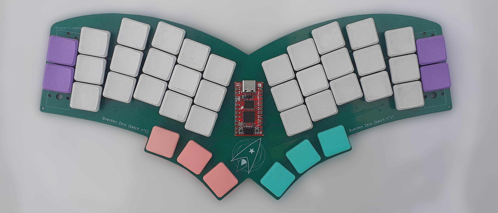
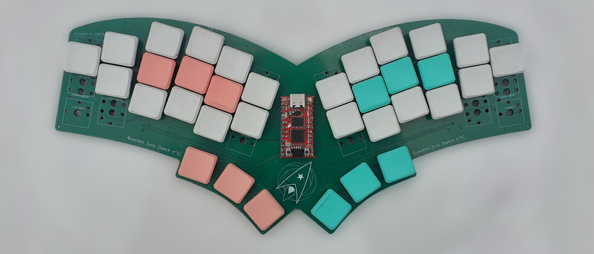
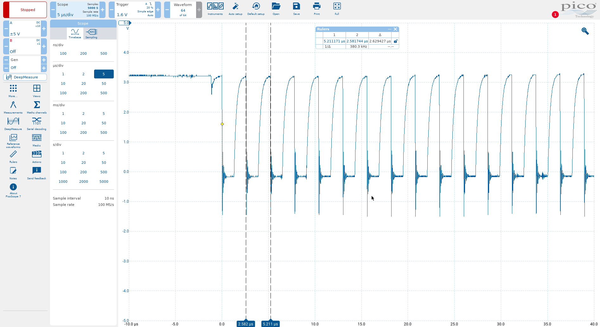
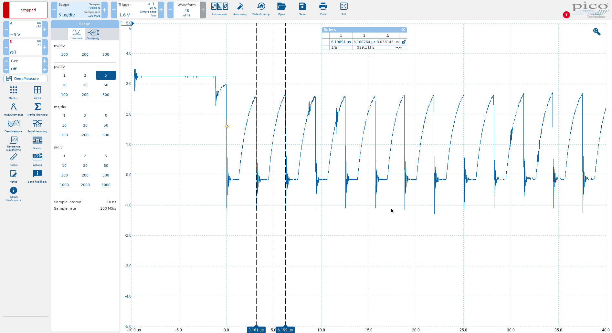
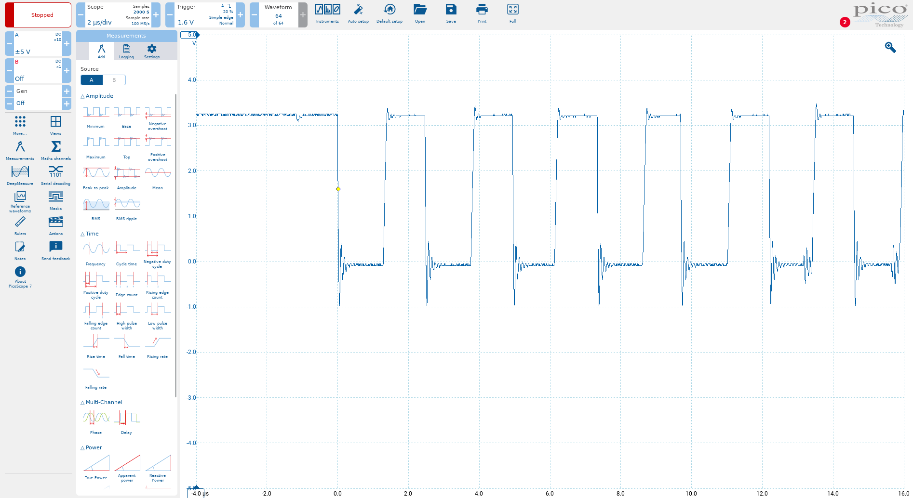
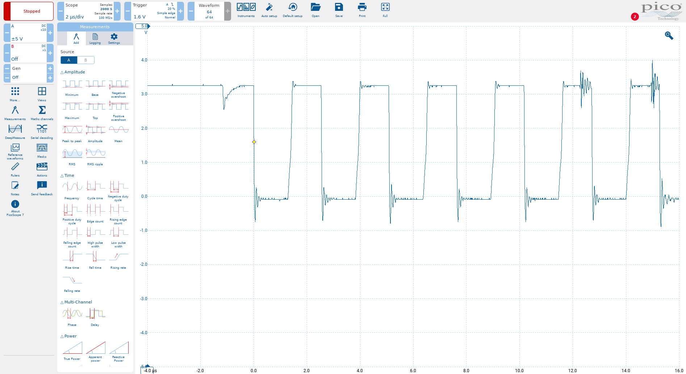

+++
title = "La mise au point du Quacken"
date = 2026-05-15T10:00:00+01:00
author = "kaze"
tags = ["communauté", "matériel"]
+++

De nos jours, il est assez facile de concevoir un clavier <i lang="en">from scratch</i> avec
[Ergogen], de faire réaliser le circuit imprimé avec JLCPCB ou autre, et de l’assembler chez soi en
y soudant des switches. GitHub regorge de modèles, c’est un domaine tellement actif qu’il y a même
des sites comme [kbd.news](https://kbd.news) pour suivre les nouveautés.

Aussi, quand avec [Nuclear-Squid] on s’est dit qu’on allait faire notre propre clavier, on
s’attendait à quelque chose de très simple. Or, non : tout ce qui a pu merder a merdé, et tout ce
qui aurait dû fonctionner d’emblée a commencé par merder aussi. De l’idée au Quacken Flex 26.01,
la route a été longue…

Au-delà de [la petite histoire du Quacken](/articles/quacken), voilà comment ce clavier a été mis au
point, quelles galères on a rencontré, quelles solutions on a trouvé.

[Nuclear-Squid]: https://github.com/Nuclear-Squid
[TeXitoi]:       https://github.com/TeXitoi
[Ash]:           https://github.com/Ashenfae
[Tam]:           https://github.com/MathildeMousset
[PacoVelobs]:    https://mamot.fr/@PacoVelobs
[Dénes Bán]:     https://zealot.hu
[Absolem]:       https://zealot.hu/absolem
[Ergogen]:       https://ergogen.xyz
[firmware ZMK]:  https://github.com/Nuclear-Squid/zmk-keyboard-quacken

[Ferris]:     https://github.com/pierrechevalier83/ferris
[Keymini]:    https://github.com/TeXitoi/keymini
[Keyberon]:   https://github.com/TeXitoi/keyberon
[uf2]:        https://github.com/microsoft/uf2
[I²C]:        https://fr.wikipedia.org/wiki/I2C
[Qwiic]:      https://www.sparkfun.com/qwiic
[ZMK Studio]: https://zmk.dev/docs/features/studio
[RP2040]:     https://www.raspberrypi.com/documentation/microcontrollers/microcontroller-chips.html
[LTC4311]:    https://www.analog.com/en/products/ltc4311.html

<!--more-->

<style>
.highlight,
blockquote,
blockquote + p { max-width: 42em; }
blockquote + p { padding: 0.5em 0; }
blockquote { background-color: var(--bg-banner); }
li li a[href] { color: var(--fg-main); }
code { font-family: monospace; }
</style>

:::{.highlight style="max-width: 32em;"}
- [Ergogen ❤️]
- [Quacken Zero (Pro Micro)]
- [Quacken Flex (contrôleur intégré)]
  - [Conception]
  - [Communication I²C]
  - [Synchronisation USB]
  - [Firmware]
  - [Géométrie]
- [Alternatives envisagées]
  - [Remplacer les Jack 3.5 mm ?]
  - [Passer à STM32 ?]
- [Conclusion]
:::


Ergogen ❤️
----------------------------------------------------------------------------------------------------

[Ergogen], c’est le bébé de [Dénes Bán], le concepteur de l’[Absolem]. En bon développeur, Dénes ne
s’est pas contenté de faire son propre clavier : il a développé un outil pour le faire. Le principe
est simple : on décrit la géométrie du clavier dans un fichier YAML ou JSON, et Ergogen produit les
fichiers AutoCad et KiCad qui permettent de le construire. Bien sûr, il reste des petites choses à
finir à la main, mais séparer aussi proprement la description de géométrie de la conception
électronique, ça simplifie énormément les choses.

Avec Ergogen, on conçoit donc un circuit imprimé (PCB) sur lequel on va souder :

- un contrôleur, sous la forme d’une carte Pro Micro ou XIAO ;
- les switches, sur lesquels on clipse les keycaps (cabochons) ;
- une éventuelle matrice de diodes, si on a plus de touches que d’E/S sur le contrôleur.

On trouve ces éléments très facilement chez des revendeurs européens comme SplitKB ou KeebSupply.
Souder les switches est trivial, il faut être un peu plus soigneux pour le contrôleur, mais ça reste
à la portée du plus grand nombre. Souder les diodes nécessite plus de précision, mais ça peut être
fait directement par le fabricant du PCB (on parle alors de PCBA).

La quasi-totalité des claviers qu’on trouve sur GitHub sont basés sur une conception de ce type.
Ergogen permet à tout un chacun de concevoir son propre clavier assez facilement.


Quacken Zero (Pro Micro)
----------------------------------------------------------------------------------------------------

On a l’idée bien en tête. On sait ce qu’on veut comme géométrie, dans les grandes lignes. L’ami
[PacoVelobs] nous fait une démo d’Ergogen, c’est parti : on se lance dans la conception du premier
prototype, un modèle monobloc basé sur un contrôleur Pro Micro, essentiellement pour valider la
géométrie et l’idée des positions médianes.

Ça a très bien fonctionné. Du premier coup. Tellement simple ! Ergogen c’est du génie.





On achète des contrôleurs RP2040 au format Pro Micro. On commence par faire un pilote <i
lang="en">bare metal</i> en Rust avec le framework [Keyberon] du camarade [TeXitoi], parce qu’on
peut, et parce que c’est très satisfaisant intellectuellement. Du bonheur.

Faire un pilote ZMK est encore plus simple. Ce framework est basé sur Zephyr, qui est prévu pour
dissocier la <i lang="en">board</i> (= le contrôleur) du <i lang="en">shield</i> (= ici, le
clavier). On décrit le routage du clavier, et on peut compiler son firmware pour n’importe quel
contrôleur. Inratable.

Côté géométrie, on voit assez vite qu’il y a des améliorations possibles. Je fais une série de
maquettes, et après quelques itérations, on converge vers cette géométrie :


On décide de faire un PCB avec cette géométrie — non pas sur une base Pro Micro comme pour le Zero,
mais en intégrant directement le micro-contrôleur. La géométrie est validée avec enthousiasme !
Mais côté électronique, c’est là que tout se corse.


Quacken Flex (contrôleur intégré)
----------------------------------------------------------------------------------------------------

### Conception

L’idée pour le Quacken Flex est d’avoir un clavier splittable. On l’imagine donc autour de :

- un contrôleur [RP2040] sur la partie gauche ;
- un IO expander 24 bits sur la partie droite ;
- une connexion [I²C] entre les deux, via un câble TRRS en mode splitté.

C’est une conception <i lang="en">diodeless</i>, chaque switch est relié directement à une IO du
contrôleur (à gauche) ou de l’IO expander (à droite).


Le STM32F est couramment utilisé pour ce genre de choses. C’est notamment le cas du [Ferris] (split)
et du [Keymini] (monobloc), deux claviers qu’on aime beaucoup ; mais on lui préfère le RP2040, plus
libre, et disposant d’un <i lang="en">bootloader</i> [UF2], une fonctionnalité à laquelle on tient.
On sait que ça va être nettement plus compliqué que d’utiliser une simple carte Pro Micro, mais on
calcule très vite que c’est indispensable pour faire tomber les coûts au niveau où on l’espère (=
environ 15 € par PCB, contrôleur inclus).

Il aura fallu 4 prototypes pour arriver à une version fonctionnelle : 25.10, 25.11, 25.12, 26.01.
L’électronique, c’est un métier ! Heureusement, on a eu l’aide du camarade [TeXitoi] et d’un de mes
clients électroniciens pour avancer.

### Communication I²C

Les 5 exemplaires de la version 25.10 ont bien fonctionné en monobloc ; mais le seul qu’on a splitté
a cessé de fonctionner, la moitié droite ne répondait plus.

En plein rush du Capitole du Libre, on n’a pas eu le temps de creuser. On s’est dit que j’avais dû
endommager le PCB en le sciant avec un outil inadapté ; puis, en y regardant de plus près, on a vu
une erreur : les résistances de <i lang="en">pull-up</i> de l’I²C étaient des 22 kΩ, au lieu des
4.7 kΩ recommandés. En ajoutant la résistance de la liaison TRRS (connecteurs + câbles), ça devient
beaucoup trop ? On corrige, on relance un proto.

Malheureusement, les 5 prototypes du lot 25.11 présentent le même symptôme : le clavier fonctionne
parfaitement en monobloc (c’est mon <i lang="en">daily driver</i>), mais en split, la communication
[I²C] ne passe tout simplement plus.

Premier suspect : les connecteurs TRRS. De fait, quand on remplace ces connecteurs et le càble TRRS
par 4 fils soudés directeument sur les PCB, ça tombe en marche. On réalise que suite à une erreur
sur un composant KiCad, c’est la ligne d’horloge à 400 kHz et non la masse qui était reliée à la
tresse de masse du câble… parfait pour causer de la diaphonie, ça.

Mais ça n’est pas le seul problème. On sort l’oscilloscope pour creuser.





OK, vu. Ça ne fonctionne pas sur notre clavier parce que l’impédance de l’ensemble câble +
connecteur est trop élevée : les signaux ont des temps de montée trop longs — d’où cette forme en
lame de couteau. En split, l’horloge n’a même pas le temps d’atteindre les 3.3 V à l’état haut.

Je trouve un composant un peu cher mais qui corrige ça activement : le [LTC4311]. On fait partir un
lot 25.12 avec ce composant, et pouf, magie, tout fonctionne comme dans un rêve :





Avec ce composant, on pourrait même avoir des mètres de câble entre les deux demi-claviers ! Bon,
problème résolu, mais ça coûte cher… on essaye donc une méthode plus simple : diminuer les
résistances de pull-up. En me renseignant un peu, je vois que pour faire passer de l’I²C sur de
« grandes » distances (quelques dizaines de cm), il est assez courant d’utiliser des pull-up de
1 kΩ au lieu de 4.7 kΩ. Le seul inconvénient c’est que ça tire un peu de courant sur le RP2040, ce
qui augmente un peu sa consommation, mais rien de gênant pour un clavier filaire.

On déssoude le LTC4311, on teste avec les petites résistances, ça fonctionne bien, on valide.
Tout ça pour ça !

On fait donc partir un lot 26.01 avec ces modifications pour valider. Le chat échaudé, l’eau froide,
on en profite pour symétriser les résistances de pull-up, ça fait partie des maniaqueries que mon
client électronicien affectionne : 2.2 kΩ sur chaque demi-clavier, ça fait un équivalent 1.1 kΩ sur
le bus I²C. Et ayé, enfin, on a un proto pleinement fonctionnel.

Sur le PCB, on a laissé l’emplacement du LTC4311, pour le cas où on voudrait en souder un
manuellement. Mais on ne l’utilisera plus. L’emplacement disparaît sur le lot de série 26.01.1.

### Synchronisation USB

[Tam] avait remarqué que le 25.11 perdait parfois la connexion USB. Il faut débrancher et rebrancher
pour que ça retombe en marche. Pas dramatique mais pénible. Et le problème ne se produit qu’à son
bureau : chez elle, ça fonctionne. Relou.

On a vu que ça ressemble à un problème qui affecte le Corne v4, lui aussi basé sur du RP2040. La
sensibilité au bruit électromagnétique est suspectée. Certains utilisateurs du Corne ont « résolu »
le problème en mettant du scotch métallique par-dessus le RP2040 pour faire office de cage de
Faraday.

Une petite recherche me montre que cette perte de synchro USB est un problème ultra-classique des
conceptions basées sur RP2040. Mince, on aurait choisi la mauvaise puce ? Je comprends que pour
fonctionner en USB HID, il faut une horloge calée précisément à 12.000 MHz. **Très** précisément.
L’écart se mesure en ppm, pas en %. On se dit qu’on a dû prendre un cristal de mauvaise qualité…
c’est forcément la faute au matériel, non ?

En fouillant les forums Zephyr et le code ZMK, je vois qu’il existe une option qui permet de
rallonger le temps d’attente pour attendre la stabilisation du cristal à 12.000 MHz.
Ça résout le problème chez Tam, parfait.

```c
&xosc {
    // Ensure the 12MHz oscillator has enough time to stabilize properly.
    // Required by Flex 25.xx, should be useless with Flex 26.01.
    startup-delay-multiplier = <64>;
}
```

Du moins, sur le modèle 25.11. Parce que sur le 25.12 : rien. Nada. Nib. Le clavier communique
bien en mode <i lang="en">bootloader</i>, mais dès qu’il rebascule en mode HID : plus rien ne
passe. C’est fou comment l’électronique, ça irrite.

Étrangement, on constate qu’avec [Keyberon], la communication passe bien. On hésite. Et si le
problème, c’était ZMK ? Ne serait-ce pas là une excuse imparable pour faire du Rust embarqué, plutôt
que de l’électronique ?

Après avoir montré le routage à mon client électronicien, il me recommande de minimiser les
longueurs de piste et de mieux séparer les lignes du cristal de celles du QSPI (qui relient le
RP2040 à la mémoire Flash). Je me dis qu’il chipote. Ça fait 30 ans que je bosse avec lui, il a
toujours été du genre à chipoter. Sauf que, étonamment, il a raison. Un peu comme si
l’électronique, c’était un vrai métier. Qui aurait pu prédire ?!?

Nuke refait le routage encore une fois, en mode parano. Tout le bloc RP2040 + cristal + Flash
devient aussi compact que possible. On fait partir le lot 26.01 : la parano a payé, tout fonctionne
enfin comme on le voulait. On peut même supprimer la tempo de stabilisation de l’oscillateur.

Cette version sera baptisée Oscar, en référence à ces histoires d’oscillateur. C’est celle qui sera
fabriquée en série pour les Ergonautes.

### Firmware

Le [firmware ZMK] a été une aventure aussi. L’<i lang="en">IO expander</i> qu’on a choisi nécessite
une version récente de Zephyr, qui n’est disponible que dans la branche `main` (nightly/instable)
de ZMK.

Une autre difficulté est que le RP2040 est mal supporté par ZMK. La situation s’améliore, là encore
avec les versions 4.x de Zephyr, mais on essuie des plâtres… On remonte des bugs, l’équipe ZMK est
réactive, et une correction est implémentée dans une branche dédiée au support HWMv2 de Zephyr
(<i lang="en">hardware model v2</i>).

Tout cela fera partie de la <i lang="en">release</i> 0.4 de ZMK. Pour l’instant, on a épinglé un <i
lang="en">commit</i> bien précis pour avoir cette branche HWMv2.

### Géométrie

On a été satisfait de la géométrie dès le tout premier prototype (25.10), mais quitte à devoir faire
des nouveaux protos pour tester les corrections électroniques, on en a profité pour tester des
ajustements.

Avec Ergogen, le <i lang="en">stagger</i> et le <i lang="en">splay</i> se définissent en relatif
d’un doigt à l’autre. Beaucoup de concepteurs de claviers se focalisent sur le <i
lang="en">stagger</i> de l’auriculaire, mais on s’est aperçu que c’est souvent l’*annulaire* qui
manque de <i lang="en">stagger</i> : l’écart annulaire/auriculaire est généralement suffisant.

On a donc testé un ajustement de géométrie sur le 25.12 : un dixième d’unité soit 1.7 mm… mais qui
fait une différence assez nette, les annulaires et auriculaires se posent désormais *pile* au centre
des touches. Adopté !


Alternatives envisagées
----------------------------------------------------------------------------------------------------

### Remplacer les Jack 3.5 mm ?

En théorie, l’I²C est prévu pour être utilisé directement sur un PCB, pas sur un câble externe. En
pratique, ça se fait quand même : il y a même un standard pour ça en électronique, le [Qwiic], qui
est basé sur un connecteur JST. Peut-être que le problème, c’est juste le TRRS ?

Ayant constaté à quel point la qualité de connexion était critique pour l’I²C, se débarrasser du
TRRS paraissait logique. Les pros de l’électronique qu’on a consultés nous ont tous dit la même
chose : passer par des connecteurs Jack, c’est une erreur grossière, ils n’ont pas été faits pour ça.

On a très logiquement envisagé de remplacer les connecteurs TRRS par des Qwiic : c’est dommage de ne
plus passer par le Jack 3.5 mm qui est un peu le standard des Poticlaviers, mais si c’est meilleur…
Problème : les connecteurs type JST ne sont donnés que pour une trentaine de cycles de connexion /
déconnexion ; et on a beau chercher, on ne trouve que deux autres connecteurs capables de supporter
les 1 000 à 10 000 cycles des connecteurs Jack.

- RJ11/RJ45 : simple, éprouvé, utilisé sur le KeyboardIO Model01, mais trop encombrant pour le
  Quacken ;
- USB : éprouvé, mais risque de confusion avec le port USB de liaison au PC, et le câble est trop
  rigide (effet de ressort entre les deux moitiés de clavier).

<i lang="en">Long story short :</i> ça serait beaucoup plus simple de faire des claviers à double
contrôleur, mais on s’y est refusé pour des questions de coût et de complexité pour les
utilisateur’ices. On reste donc sur une solution mono-contrôleur… et là, le connecteur Jack 3.5 mm
est le plus adapté mécaniquement, tout en étant *acceptable* électriquement.

Un connecteur magnétique 4 points type Pogo serait idéal, mais en attendant : <i lang="en">in TRRS
we trust</i>.

### Passer à STM32 ?

Nuke déteste ST en général et leur écosystème logiciel en particulier : basé sur Eclipse, reposant
sur de la génération de <i lang="en">boilerplate</i> plutôt que sur des abstractions logicielles,
et non libre par-dessus le marché…

Accessoirement, les puces STM32 n’ont pas de <i lang="en">bootloader</i> [UF2], qui permet de
flasher par un simple glisser-déposer. Pour le Quacken, qu’on veut accessible au plus grand nombre,
c’est un problème.

Cela étant dit : si vous envisagez de faire votre propre projet embarqué (clavier ou autre), sachez
que les contrôleurs STM32 peuvent se passer d’un cristal externe (en se calant sur l’horloge du
contrôleur USB hôte), et qu’ils intègrent leur propre mémoire Flash, anisi que certaines résistances
et capacités de protection du circuit. C’est donc *beaucoup* plus simple à mettre en œuvre et à
intégrer qu’un RP2040.

On ne regrette absolument pas notre choix du RP2040, mais voilà, vous êtes prévenus. 🙂


Conclusion
----------------------------------------------------------------------------------------------------

Faire un clavier sur base Pro Micro ou XIAO a été beaucoup plus simple que prévu. C’est à la portée
de beaucoup de gens, et on vous encourage à essayer !

Faire un clavier avec un contrôleur intégré, c’est plus piégeur, surtout avec une base RP2040.
On n’aime pas STM32 mais ayé, on a compris l’intérêt : ça évite beaucoup d’erreurs courantes.
C’est probablement un choix raisonnable — donc pas pour nous.

Électroniquement, la conception d’un clavier est très simple, même avec un contrôleur intégré. Le
routage, par contre, est critique. Il y a mille pièges à éviter, on en a expérimenté quelques-uns.
Chaque erreur de routage suffit à causer un dysfonctionnement.

Encore un grand merci à [TeXitoi] pour son aide décisive tout au long de ce projet. 🙏

[Nuclear-Squid] a publié tout son travail [sur son dépôt](https://github.com/Nuclear-Squid/Quacken) :
la géométrie Ergogen (incluant les composants spécifiques pour le Quacken), la conception KiCad et
le routage. On va essayer d’améliorer encore le routage au fil des versions à venir.

On espère que notre expérience va baliser un peu le chemin, et que le design électronique du Quacken
pourra être réutilisé pour plein d’autres Poticlaviers. Puisse le Quacken avoir une descendance
nombreuse et prolifique !
