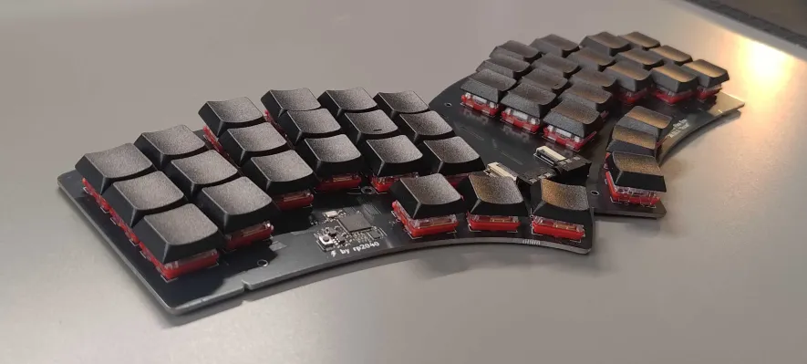
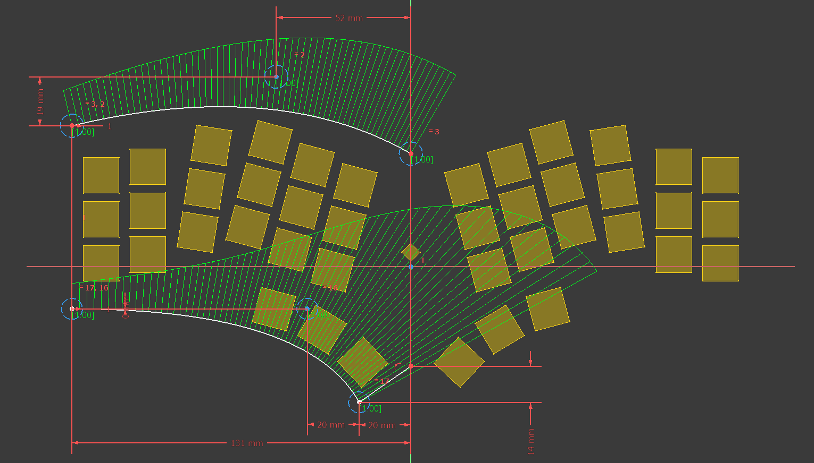
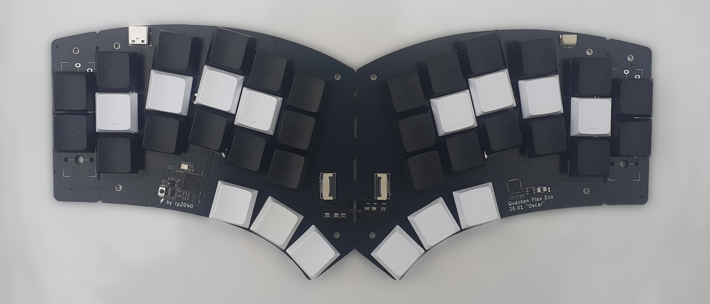
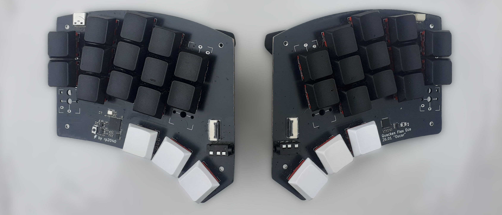
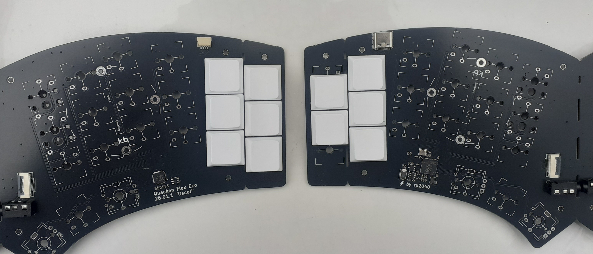

+++
title = "Quacken : an 1"
date = 2026-05-15T08:00:00+01:00
author = "kaze"
tags = ["communauté", "matériel"]
+++

Si on avait carte blanche pour faire le meilleur clavier de <i lang="en">group buy</i> du monde, ça
donnerait quoi ? C’est la question qu’on s’est posée il y a deux ans avec [Nuclear-Squid], en
attendant le thermique au bord du lac. De fil en aiguille, des idées ont émergé…

Il y a un an, on se lançait dans la conception du premier prototype ; il y a six mois, on le
présentait au [Capitole du Libre], pour le proposer à prix libre sur la [boutique HelloAsso] ; et il
y a quelques jours, après des centaines d’heures de travail cumulées, on livrait le premier lot
qu’on a fabriqué pour les Ergonautes.

Je vous raconte la naissance du [Quacken].

[Nuclear-Squid]:           https://github.com/Nuclear-Squid
[conception électronique]: https://github.com/Nuclear-Squid/quacken
[firmware ZMK]:            https://github.com/Nuclear-Squid/zmk-keyboard-quacken

[TeXitoi]: https://github.com/TeXitoi
[Seraf]:   https://github.com/severindupouy
[Ash]:     https://github.com/Ashenfae

[JDLL 2026]:          https://jdll.org
[Capitole du Libre]:  https://cfp.capitoledulibre.org/cdl-2025/talk/PHPTKK/
[boutique HelloAsso]: https://www.helloasso.com/associations/les-ergonautes/boutiques/quacken
[annonce Mastodon]:   https://eldritch.cafe/@ergonautes/115933914956646384
[Ækeynox-QMK]:        https://github.com/OneDeadKey/qmk-config-aekeynox
[Ækeynox-ZMK]:        https://github.com/OneDeadKey/zmk-config-aekeynox
[Selenium]:           https://onedeadkey.github.io/selenium
[Quacken]:            https://onedeadkey.github.io/quacken

[1DFH]:        /presentation/#dfh-1u-distance-from-home
[Arsenik]:     /claviers/arsenik
[Ferris]:      https://github.com/pierrechevalier83/ferris/
[uf2]:         https://github.com/microsoft/uf2
[I²C]:         https://fr.wikipedia.org/wiki/I2C
[ZMK Studio]:  https://zmk.dev/docs/features/studio
[RP2040]:      https://www.raspberrypi.com/documentation/microcontrollers/microcontroller-chips.html
[Ergogen]:     https://ergogen.xyz
[PacoVelobs]:  https://mamot.fr/@PacoVelobs/
[Hummingbird]: https://github.com/PJE66/hummingbird

<!--more-->

:::{.highlight style="max-width: 32em;"}
- [Un clavier unique pour les cliqueter tous]
- [Géométrie radi(c)ale]
- [Positions médianes]
- [Présentation au Capitole du Libre]
- [Mise au point, fabrication, expédition]
- [Modèle économique <i lang="en">open-hardware</i>]
- [Bon à quel point ?]
- [La suite ?]
:::

Un clavier unique pour les cliqueter tous
----------------------------------------------------------------------------------------------------

J’ai une collection inavouable de claviers ergonomiques, certains hors de prix. Je les adore… mais
je ne m’en sers plus : avec [Arsenik] et le clavier ISO de mon laptop, j’ai quelque chose de quasi
aussi bien, voire meilleur que la plupart d’entre eux. Alors, si on devait concevoir un clavier, que
devrait-il apporter de plus ?

- des contacts bien légers sous les doigts ;
- une construction aussi <i lang="en">low-profile</i> que possible ;
- une géométrie vraiment poussée, pour ne plus bouger les doigts du tout ;
- et surtout, des bonnes touches de pouces !

Le hic, c’est que même avec JLCPCB, les circuits imprimés se produisent par séries de 5 au minimum.
Et si on veut que ça ne coûte pas trop cher (pour rappel, le clavier de laptop fait déjà très bien
le job, merci [Arsenik]), il faut qu’on puisse en faire un <i lang="en">group buy</i>, et donc
convenir à plein de besoins différents :

- monobloc, mais splittable — <i lang="en">unpopular opinion</i>, les claviers splittés ont peu
  d’intérêt par rapport à la complexité engendrée… mais voilà, tout le monde veut ça ;
- 5 ou 6 colonnes — les sixièmes colonnes doivent être amovibles, pour les gens comme moi qui
  trouvent que ça encombre bêtement, ou pour celleux qui veulent faire du <i lang="en">tenting</i> ;
- compatible avec des configurations type Hummingbird, pour celleux comme [Nuclear-Squid] qui
  trouvent que trois touches par auriculaire, c’est au moins une de trop.

Pour l’aspect monobloc splittable, il suffit de faire comme le [Ferris], qui a une connexion [I²C]
entre les deux parties : un contrôleur à gauche, un <i lang="en">IO expander</i> à droite, paf,
Chocapics. On sépare les deux moitiés d’un trait de scie, un connecteur TRRS pour les relier,
<i lang="en">what could possibly go wrong ?</i>

Enfin, on veut que le clavier soit facile à flasher et à configurer. C’est souvent le propre des
claviers premium que d’avoir ce confort-là, et ça n’est pas normal. On opte donc pour :

- un <i lang="en">firmware</i> avec support [ZMK Studio], pour pouvoir faire des petites modifs
  depuis un navigateur web ;
- un contrôleur [RP2040], pour permettre un flash complet depuis l’explorateur de fichiers ([uf2]),
  et pour le fait que le <i lang="en">bootloader</i> soit en ROM : <i lang="en">unbrickable</i>.

Pour que le coût unitaire soit aussi bas que possible, on comprend rapidement qu’il faut que le
contrôleur soit intégré au circuit imprimé (PCB), et non sur un socket ProMicro ou XIAO comme le
font la plupart des designs DIY. C’est nettement plus compliqué, mais Nuke fait des études
d’électronique, donc tout va bien se passer ? (Mouahahaha, <i lang="en">famous last words…</i>.)

Géométrie radi(c)ale
----------------------------------------------------------------------------------------------------

Les fabricants mainstream de claviers ergonomiques doivent faire des compromis sur la géométrie pour
rassurer leurs éventuels acheteurs, quitte à dégrader l’ergonomie : c’est un impératif commercial.
Notre objectif est de faire exactement l’inverse : une géométrie sans compromis, pour un clavier
qu’on va fabriquer collectivement afin de réduire les coûts.

On est fan de claviers (très) compacts, la magie du [1DFH] permettant d’aller vers des géométries
qui tombent bien sous les doigts : un bon <i lang="en">stagger</i> vertical pour compenser les
différences de longueur des doigts, un <i lang="en">splay</i> prononcé pour laisser les auriculaires
s’étendre vers l’extérieur, et surtout : des touches de pouces placées sur un arc de cercle, pour
avoir enfin trois vraies touches par pouce.

On réalise un premier proto monobloc sur base ProMicro avec [Ergogen], un outil incroyable que nous
avait montré l’ami [PacoVelobs]. On le baptise Quacken Zero. C’est notre tout premier poticlavier !
Il y a des choses qu’on aime, d’autres auxquelles on finit par se faire, et d’autres qu’on aime
moins. C’est un bon clavier, je l’utilise encore (c’est mon clavier secondaire), mais ça n’est pas
*pile* ce qu’on veut.

On se rend vite compte d’une chose : avec ce type de géométrie, c’est tout ou rien, il n’y a pas
d’entre-deux. Ça tombe bien, les compromis c’est pas notre truc. On se remet donc à la planche à
dessin (dans mon cas : du SVG fait avec Vim). On imprime des maquettes, on pose les doigts dessus,
on ajuste, on compare. Après quelques itérations, on converge vers cette géométrie :

- 30° entre les mains (les index sont dans l’alignement naturel des avant-bras) ;
- 15° de <i lang="en">splay</i> cumulé sur les auriculaires, ce qui s’avère certes très confortable,
  mais aussi bien pratique pour faire du <i lang="en">tenting</i> ;
- des touches de pouce en arc de cercle, la touche la plus rentrée étant dans l’axe de la colonne de
  repos de l’index (et non celle du majeur comme sur un clavier ISO).

On le fait fabriquer… et **ça marche !** La géométrie fonctionne exactement comme on le voulait. On
finira par le baptiser « Quacken Flex ». À partir de là, les ajustements se feront millimètre par
millimètre.

Positions médianes
----------------------------------------------------------------------------------------------------

Trois des six colonnes du Quacken peuvent se monter de deux façons différentes :

- standard, avec trois touches ;
- médiane, avec deux touches décalées de 0.3 unités.

Ce décalage de 0.3u, combiné au <i lang="en">stagger</i> des colonnes, permet d’avoir une colonne
qui est *pile* à mi-hauteur de sa colonne adjacente. C’est très agréable pour les extensions
d’auriculaires, et ça permet aussi d’explorer des configurations plus exotiques, proche de l’esprit
[Hummingbird].

<iframe style="width: 100%; aspect-ratio: 3/2; border: none;"
    src="https://onedeadkey.github.io/quacken/keeb.html"></iframe>

Chaque configuration porte un nom d’oiseau. La Chouette (<i lang="en">Owl</i>) est à nos yeux une
bonne façon d’utiliser six colonnes sur un clavier, mais beaucoup d’utilisateur’ices lui préfèrent
les configurations classiques 3×6 (Corbeau / <i lang="en">Raven</i>) ou 3×5 (Huppe / <i
lang="en">Hoppoe</i>).

Tous les choix sont valides : *votre clavier, vos règles !*

Présentation au Capitole du Libre
----------------------------------------------------------------------------------------------------

On part au CdL avec nos 5 protos avec une idée bien précise en tête : trouver des gens qui veulent
aussi un Quacken. Plus on sera nombreux, plus le prix unitaire sera bas.

Le clavier plait. Beaucoup ! On n’a quasiment que des retours enthousiastes. Les commandes
s’enchainent. Un visiteur insiste pour acheter mon proto perso, il fera des jaloux. On arrête les
prises de commandes à la fin novembre : c’est acté, il va falloir fabriquer 75 poticlaviers.

Bien sûr, ça reste un clavier compact, donc il faut savoir taper dans une disposition [1DFH], les
Bépoètes sont déçus ; et sans méthode dactylo stricte, le clavier est tout bonnement inutilisable.
Pourtant, le fait qu’il soit monobloc par défaut le rend plus accessible qu’on l’aurait cru. On voit
des débutants passer commande, on s’inquiète… peur de décevoir…

On n’a pas eu le temps de mettre au point une version <i lang="en">hotswap</i>. On propose donc aux
personnes intéressées de faire le montage nous-mêmes, à prix libre évidemment. La majorité saisiront
l’option.

Petite déception : tout le monde ou presque a commandé son Quacken en configuration 42 touches. On
pensait que les positions médianes feraient fureur, ça a été un énorme flop. 😅

Mise au point, fabrication, expédition
----------------------------------------------------------------------------------------------------

La mise au point a été laborieuse. L’aide de [TeXitoi] et d’un de mes clients électroniciens aura
été décisive. Il aura fallu quatre prototypes avant d’arriver à une version fonctionnelle…
[J’en ai fait un article complet.](/articles/la_mise_au_point_du_quacken)

Quand on a enfin reçu les PCB finalisés, il a fallu en assembler la majorité : clipser les switches
selon la configuration choisie, faire souder les switches par des pros, mettre les keycaps, flasher
avec une config sur-mesure (on parlera de [Selenium] une autre fois !)… des heures de jeu…

Puis vient le temps de l’expédition — bon sang, c’est complètement fou le temps que ça prend, si ça
se trouve c’est un vrai métier ?!? Comme pour le reste, on apprend sur le tas. On se dit qu’on a
bien fait de limiter les commandes. On aurait même dû en prendre beaucoup moins…

Comme prévu, une fois les expéditions effectuées, on a publié les sources du clavier : pas seulement
le [firmware ZMK], mais aussi toute la [conception électronique] de Nuke, le routage, etc.

Au total, on a englouti des centaines d’heures dans le projet. On a clairement sous-estimé la part
liée aux commandes et à la logistique. Jamais on n’aurait pu y arriver sans [Ash], qui non seulement
s’est tapé la gestion de toutes les commandes et toutes les appros, mais qui *en plus* est venu’
m’aider à assembler et emballer les claviers.

Modèle économique <i lang="en">open-hardware</i>
----------------------------------------------------------------------------------------------------

### Libre et bénévole

Le projet est développé par trois personnes sans revenu fixe, qui travaillent bénévolement : [Ash],
[Nuclear-Squid], moi-même. [On est constitué en asso](/articles/1901/) pour gérer les frais liés au
projet. On n’a pas de but lucratif, on utilise juste l’argent des dons et des ventes pour financer
le projet, notamment :

- les prototypes requis pour mettre au point et faire évoluer le clavier ;
- les fournitures pour livrer les claviers commandés (PCB, keycaps, switches, etc.) ;
- rembourser nos frais de déplacement aux conférences où on présente le Quacken.

On développe le clavier de façon incrémentale : chaque lot vendu doit servir à financer le
développement du modèle suivant. On ne veut pas réitérer l’erreur du Flex, où ce sont les commandes
qui ont permis, in extremis, de payer la mise au point.

Comme tout ce qu’on fait, le Quacken est libre. Il est proposé sous licence GPLv3 pour que chacun’e
puisse utiliser, étudier, modifier et produire ce clavier.

- Si vous voulez soutenir le projet, nous aider à tirer les prix vers le bas (achat groupé) et à
  financer les autres développements, achetez votre clavier auprès de la [boutique HelloAsso].
- Si vous voulez modifier ou améliorer le clavier, forkez le projet, fabriquez-le, et proposez vos
  modifications avec un patch : la GPLv3 sert à ça.
- Si vous voulez juste produire votre Quacken, les sources sont en ligne, y a juste à passer
  commande auprès de JLCPCB ou autre.

Si le clavier devient populaire, beaucoup de gens se contenteront de la troisième option. Ça ne
soutient pas le projet et ça nous aide pas à faire descendre les prix des PCB, mais ça contribue à
péter le business des claviers à 400 €, c’est toujours ça de pris ! ✊

### Les limites du modèle

Publier les sources *avant* d’avoir remboursé les frais avancés, c’est un piège. On s’est fait avoir
sur le Quacken Zero : un membre du serveur Discord a pris les sources, s’est plaint d’erreurs de
nomenclature, a produit des exemplaires et les a vendus sur le serveur — sans proposer de patch pour
corriger les erreurs relevées. Et on s’est retrouvé avec des PCB invendus.

La mise au point du Quacken Flex s’est avérée bien plus complexe (donc coûteuse) que prévue. Pour
éviter qu’un quidam ne produise une série de Quacken avant qu’on ait eu le temps de livrer les
nôtres, on a annoncé qu’on publierait les sources [après la livraison des commandes 2025][annonce Mastodon].

Ça a été difficile à admettre pour certains Ergonautes. On le comprend bien.

Ça a même viré au harcèlement pour obtenir les sources plus tôt. On le comprend moins. Ça a été
particulièrement difficile à vivre pour l’équipe. J’écrirai peut-être à ce sujet un jour.

*In fine*, 24h après la publication des sources, la première personne qui annonce « envisager » de
produire son propre lot de Quacken est celle qui avait mené la charge du harcèlement. Ça n’est ni
une surprise… ni un problème : si on ne voulait pas que ça se produise, on ne publierait pas sous
licence libre. On fait du libre *malgré* ce type de personnes.

### Les vertus du prix libre

Le prix libre a très bien fonctionné : la générosité des uns a compensé le manque de moyens des
autres. Ça nous a permis de livrer des Quacken au meilleur prix possible pour le plus grand nombre,
tout en faisant un peu de marge pour payer les prochains protos.

On a eu aussi des dons. Et des messages de soutien. Ça nous met la larme à l’œil. Quel dommage que
les belles personnes soient si discrètes, alors que les sacs à merde accaparent autant l’attention !
J’aimerais pouvoir contribuer à changer ça, au moins au sein de notre communauté.

À celles et ceux qui nous ont soutenus dans toute cette aventure : c’est pour vous qu’on bosse, et
qu’on a plaisir à le faire. Merci à vous. ❤️

Bon à quel point ?
----------------------------------------------------------------------------------------------------

Ça fait six mois que j’ai un Quacken Flex au boulot. Tous les lundis, j’arrive au taf, je
m’installe, je commence à répondre aux courriels sur mon Poticlavier.

Et *à chaque fois* : je suis surpris par l’efficacité. *Littéralement* surpris. Au sens de : « ah
ouais, quand même ! ». À chaque fois.

Ça fait 20 ans que j’ai commencé cet intérêt spécifique sur les claviers ergonomiques, et je suis
*surpris* tous les lundi par l’efficacité du Quacken. C’est à ce niveau-là.

Bien sûr, quand on fait soi-même son clavier, on manque d’objectivité ; et ça reste un clavier assez
ambitieux, pas un modèle grand public. Je trouve que c’est de loin le meilleur clavier que je
connaisse, mais j’ai un penchant pour la simplicité ; pour [Ash], à l’inverse, ça n’est que le
meilleur clavier 2D : c’est son clavier de vadrouille préféré, mais iel reste fidèle à son Glove80
pour le bureau.

Bref. Essayez-le, et dites-nous. 😊

La suite ?
----------------------------------------------------------------------------------------------------

On va relancer la fabrication d’un lot de Quacken Flex. Les commandes sont ouvertes jusqu’à fin mai
— toujours à prix libre, toujours sur la [boutique HelloAsso]. On se dirige vers un rythme de
production de deux lots par an : un en juin après les JdLL, un en décembre après le CdL.

Le Quacken sera disponible à l’essai sur le stand des Ergonautes aux [JdLL 2026]. Avec, je l’espère,
le proto d’un autre projet qui me tient à cœur, et sur lequel on a beaucoup bossé aussi.

On a entamé un gros boulot avec [Selenium]. Le <i lang="en">firmware</i> du Quacken repose sur
l’implémentation [Ækeynox-ZMK], qui permet de configurer Selenium sur plusieurs claviers ZMK. Le
camarade [Seraf] bosse sur l’implémentation [Ækeynox-QMK], pour les claviers QMK. Les contributions
à ces projets sont bienvenues !

On a plein de choses prévues, mais je m’interdis désormais de les annoncer. Ça sortira quand ça
sera prêt, comme pour tout bon projet libre.

Encore merci à toutes les personnes qui nous ont soutenus. 🙏

<i lang="en">Happy typing !</i>
