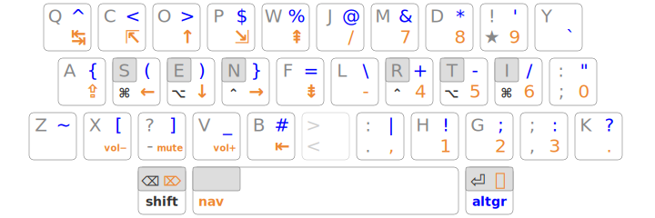

+++
title = "Arsenik"
+++

Une adaptation de [Miryoku][] pour les claviers de <i lang="en">laptop</i> et
les claviers compacts.

<!--more-->

Fonctionnement
-------------------------------------------------------------------------------

On conserve la base de l’approche [Miryoku][] : layer-taps sous les pouces et
homerow-mods sous les doigts.

### Layer-taps

Chaque touche de pouce assure deux fonctions :

- émettre [Backspace]{.kbd}, [Espace]{.kbd}, [Entrée]{.kbd} quand elle est
  pressée et relâchée rapidement (*tap*) ;
- activer [Shift]{.kbd}, [NavNum]{.kbd}, [AltGr]{.kbd} quand elle est maintenue
  (*hold*).

La couche [NavNum][] est la même que celle qui est proposée pour les claviers
compacts. Elle se déclenche après avoir maintenu la barre d’espace pendant
300 ms (par défaut), ce qui est suffisant pour éviter les déclenchements
intempestifs : lors d’une saisie rapide de texte, c’est bien [Espace]{.kbd} qui
est émis par défaut — mais uniquement au relâchement de la touche, ce qui peut
perturber au début.

[Shift]{.kbd} et [AltGr]{.kbd} sont considérés comme des layers au même titre
que [NavNum]{.kbd}, mais avec une différence de synchronisation importante :
pour produire le *tap*, elles doivent être pressées et relâchées sans qu’aucune
autre touche n’ait été activée, sans quoi c’est le *hold* qui est retenu.

On parle alors de comportement « **Space Cadet** » ou « <i lang="en">permissive
hold </i> » : **cela permet à [Shift]{.kbd} et [AltGr]{.kbd} d’être déclenchées
sans aucun délai susceptible de ralentir la saisie**, et les touches associées
en *tap* sont beaucoup moins susceptibles d’être actionnées par erreur.

### Homerow-mods

De même que la couche NavNum est associée à [Espace]{.kbd}, les modifieurs
[Ctrl]{.kbd}, [Alt]{.kbd}, [Cmd]{.kbd} sont associés aux touches de repos des
deux mains : [N]{.kbd} [E]{.kbd} [S]{.kbd} pour la main gauche, [R]{.kbd}
[T]{.kbd} [I]{.kbd} pour la main droite.

Là encore, la touche se comporte comme un *tap* tant qu’elle n’est pas maintenue
au moins 300 ms ; on accepte donc un délai avant d’activer un modifieur.

Plus ce délai est long et moins on est susceptible de déclencher des modifieurs
par erreur quand on ne relève pas les doigts suffisamment vite. [Shift]{.kbd} et
[AltGr]{.kbd} n’étant pas affectées par ce délai, on peut le rallonger sans que
ça ne gêne la vitesse ou le confort de saisie.

Claviers de <i lang="en">laptop</i>
--------------------------------------------------------------------------------

### <i lang="en">Angle-mod</i>

On applique un [angle-mod][], c’est-à-dire une permutation circulaire sur les 5
touches de gauche de la rangée inférieure, afin de mieux respecter l’angle des
poignets et de se rapprocher d’une disposition ortholinéaire :

Les barres d’espace des laptops ayant généralement une largeur de 5u, cet
angle-mod symétrise aussi le placement des deux autres touches de pouces, qui se
retrouvent dans l’alignement des majeurs.

### Kanata

[kanata][] est un logiciel libre et multiplate-formes permettant de redéfinir le
comportement des touches du clavier. Il permet notamment l’application de
l’angle-mod, la définition de layers, la configuration de layer-taps et
homerow-mods — et plus généralement, de faire une grande partie de ce que font
les <i lang="en">firmwares</i> de claviers programmables comme QMK et ZMK.

Une configuration « clé en main » sera proposée prochainement.

Claviers compacts
--------------------------------------------------------------------------------

### Claviers avec barre d’espace centrale

Arsenik est très naturel sur des claviers comme le [Planck][], le [Preonic][],
le [Reviung][]…

![Arsenik sur un [Planck][]](arsenik_planck.svg)

### Claviers splittés

Sur un clavier splitté on a au moins deux touches par pouce. Une solution simple
consiste à doubler la touche [NavNum]{.kbd} :

![Arsenik sur un [Ferris][]](arsenik_ferris.svg)

On peut également scinder la couche NumNav en une couche numérique et une couche
de navigation, ou ajouter une couche pour les touches F1…12, ou une couche pour
l’émulation souris…

<!--
Variante « Selenium »
--------------------------------------------------------------------------------

Les claviers disposant de  deux touches par pouce donnent facilement accès à 4
layers. On peut en profiter pour séparer le layer [NavNum][] en un layer de
navigation et un layer numérique.

![Selenium sur un [Ferris][]](selenium.svg)

### Layer « Navigation »

- en main gauche : Tab/S-Tab, précédent/suivant, raccourcis Qwerty usuels
- en main droite : déplacements vimistes, page up/down, home/end, défilement

Cette couche est très orientée pour un usage technique :

- profiter des déplacements « HJKL » de Vim dans n’importe quelle application ;
- faire défiler les suggestions de complétion avec Tab/S-Tab sur les deux doigts
  forts en homerow (comme les JK de Vim).

La paire Tab/S-Tab est pratique aussi pour changer de fenêtre avec [Alt]{.kbd},
d’application avec [Cmd]{.kbd}, d’onglet avec [Ctrl]{.kbd}.

### Layer « NumRow »

- sur la rangée médiane : chiffres
- sur la rangée supérieure : [Shift]{.kbd} + chiffres 
- sur la rangée inférieure :
  - à gauche, touche Typo + chiffres
  - à droite, séparateurs décimaux et de nombres

Cette couche est pensée pour les personnes qui préfèrent taper des nombres à dix
doigts plutôt qu’à trois doigts (pavé numérique), mais elle facilite aussi une
typographie soignée. À noter : la touche [Espace]{.kbd} devient
[Shift]{.kbd}+[Espace]{.kbd} dans ce layer.

### Pourquoi les noms « Arsenik » et « Selenium » ?

C’est une référence aux numéros atomiques de ces deux éléments : 33 et 34
respectivement, correspondant au nombre de touches utilisées. La dualité
arsenic/selenium est une référence cinématographique. 
-->

Pour qui ?
--------------------------------------------------------------------------------

Pour les utilisateurs et utilisatrices avancées qui maitrisent ou souhaitent
apprendre les layer-taps et homerow-mods, Arsenik apporte l’essentiel de
l’ergonomie des claviers compacts aux claviers de laptop :

- pour s’habituer aux layer-taps et homerow-mods avant d’acheter un clavier
  ergonomique — ce faisant, on pourra directement choisir un clavier très
  compact, bien moins onéreux qu’un full-size et moins susceptible d’être
  remplacé au fil de la progression ;
- pour adopter une technique de saisie quasi identique entre son clavier de
  laptop et son clavier ergonomique.

Arsenik n’est pas réservé aux Ergonautes : il complète très bien Ergo‑L et les
autres dispositions de la famille Lafayette, mais il peut s’appliquer à d’autres
dispositions comme Azerty, Qwerty et tous les arrangements du Qwerty ANSI
(Dvorak, Colemak, Workman, MTGAP, ISRT, Sturdy…), en associant la touche
[Sym]{.kbd} à une couche de symboles dédiée.

[NavNum]:        ,,/compacts/#layer-navnum
[Selenium]:      #variante-selenium
[arsenik.kbd]:   arsenik.kbd
[selenium.kbd]:  selenium.kbd

[Miryoku]:   https://github.com/manna-harbour/miryoku
[kanata]:    https://github.com/jtroo/kanata
[angle-mod]: https://colemakmods.github.io/ergonomic-mods/angle.html

[Preonic]:   https://olkb.com/collections/preonic
[Planck]:    https://olkb.com/collections/planck
[Reviung]:   https://github.com/gtips/reviung
[Ferris]:    https://github.com/pierrechevalier83/ferris
