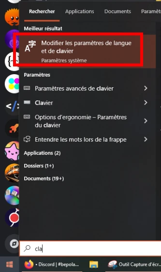
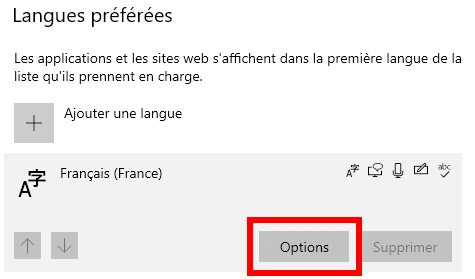
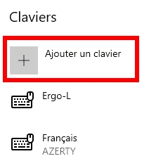
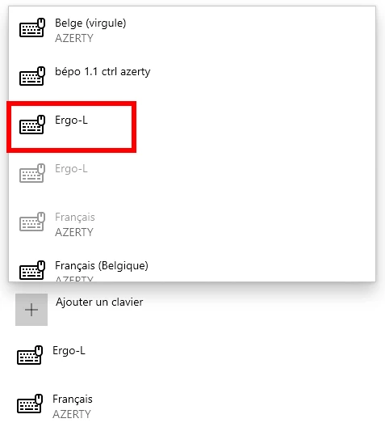
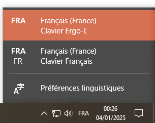
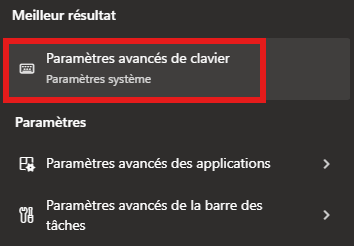
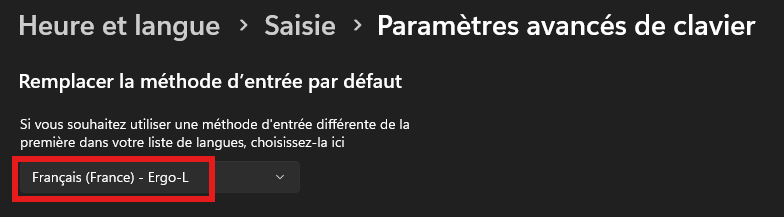

+++
title = "Installation"
aliases = ["lts"]

[params]
cssSheets = ["/css/keebs.css"]
jsModules = ["/js/x-keyboard.js"]
jsScripts = ["/js/keebs.js"]
footer = "propulsé par [x-keyboard](https://onedeadkey.github.io/x-keyboard)"
+++




Note aux utilisateurices de claviers programmables
--------------------------------------------------------------------------------

Il y a deux façons d’utiliser Ergo‑L sur un clavier programmable :

- soit on laisse le clavier en Qwerty dans QMK/ZMK/Vial, et c’est le pilote côté
  ordi qui s’occupe de la disposition (liens de téléchargement plus bas) ;
- soit on cherche à émuler Ergo‑L côté QMK/ZMK/Vial, pour avoir la disposition
  sur un ordi qui reste configuré en Azerty.

La première méthode est vivement recommandée. On peut alors configurer son
clavier très facilement, il faut juste avoir AltGr sur une touche de pouce pour
accéder aux symboles.

L’émulation est **beaucoup** plus compliquée, et n’est pertinente qu’en **dernier
ressort** : ordinateur totalement verrouillé (même pour le pilote nomade),
administration de nombreuses machines, ou autre besoin spécifique. Une émulation
basique d’Ergo‑L au-dessus d’Azerty ou Qwerty-Intl est expérimentée sur
[le firmware ZMK du Quacken][Quacken ZMK], elle sera proposée à d’autres
claviers via le projet [Ækeynox].


Téléchargement
--------------------------------------------------------------------------------

### Pilotes nomades : [ergol_nomade.zip][]

Une archive ZIP contenant les pilotes ne nécessitant pas de droits
d’administration, qui peuvent fonctionner depuis une clé USB. (Pour tous les
systèmes.)

### Windows : [ergol_kbd.exe][]

Exécuter l’installeur et relancer la session. La disposition de clavier
apparait dans la barre de langues (indicateur de la barre des tâches).

L’installeur support Windows 32 et 64-bit Intel, ainsi que 64-bit ARM.

<details>
<summary>Ajouter la disposition installée dans la liste (Windows 10)</summary>

Note : il n’est normalement pas nécessaire de faire ces étapes avec le pilote
installé ci-dessus.

1. Dans le menu Démarrer, rechercher « Modifier les paramètres de langue et de
   clavier »

   

2. Cliquer sur « Options » sur « Français »

   

3. « Ajouter un clavier »

   

4. Il devrait y avoir Ergo‑L dans la liste, cliquer dessus

   

5. Ergo‑L est maintenant ajouté. On devrait voir en bas à droite une icône
   « FRA » ou « FRA FR » pour choisir le clavier s’il y en a plusieurs dans la
   liste

   

</details>

<details>
<summary>Disposition clavier par défaut</summary>

1. Rechercher dans le menu Démarrer « Paramètres avancés de clavier »

   

2. Dans « Remplacer la méthode d’entrée par défaut » : choisir sa dispo préférée
  dans le menu déroulant

   

</details>


### macOS : [ergol.keylayout][]

Télécharger et enregistrer le fichier keylayout en lien ci-dessus dans
`/Library/Keyboard Layouts` et relancer la session. La disposition de clavier
est disponible dans les préférences système sous « Clavier », « Méthodes de
saisie », `+` (ajouter une nouvelle disposition), et enfin « Autres ».

On peut aussi l’enregistrer dans `~/Library/Keyboard Layouts`
(pour le seul utilisateur courant), mais la disposition ne sera pas
active au login.

Il est possible (et recommandé) d’utiliser [Karabiner][]
pour [inverser les touches](karabiner_settings.png) [⌘ Command]{.kbd}
et [⌥ Option]{.kbd} à droite, afin d’accéder plus facilement à la couche
de symboles.

### Linux : [ergol.xkb_symbols][]

Ergo‑L est déjà inclus dans toutes les distributions Linux dotées de `xkeyboard-config`
en [version 2.42 ou ultérieure](https://repology.org/project/xkeyboard-config/versions),
ce qui inclut notamment Arch, Debian 13, Fedora 41, Gentoo, Manjaro, OpenMandriva 6.0,
OpenSUSE Tumbleweed, Slackware Current, Ubuntu 24.04.

:::{.highlight}
⚠️ Ne choisissez la variante ISO qu’après avoir pris connaissance de ce que ça
implique dans la [section « angle mod »](#variante-en-a-angle-mod).
:::

<details>
<summary>Installation pour d’autres distributions</summary>

Si Ergo‑L n’est pas disponible nativement, copier ce pilote dans `xkb/symbols/custom` :

```bash
sudo wget -O ${XKB_CONFIG_ROOT:-/usr/share/X11/xkb}/symbols/custom \
https://github.com/Nuclear-Squid/ergol/releases/download/ergol-v1.0.0/ergol.xkb_symbols
```

La disposition de clavier ainsi installée est disponible dans le gestionnaire de
préférences du bureau sous un nom générique (« A user-defined custom Layout »,
« Une disposition définie par l'utilisateur », etc.).

Si votre environnement de bureau utilise encore XOrg (X11) et pas Wayland,
Ergo‑L peut aussi être activé directement en ligne de commande :

```bash
setxkbmap custom
```

D’autres méthodes d’installation sont possibles, en passant le [fichier
source][] à [XKalamine][].
</details>

### Aide-mémoire : [cavalier.pdf][]

Une aide pour apprendre la dispo. À imprimer, plier et placer sur son bureau !


Variante en A (« <i lang="en">angle mod</i> »)
--------------------------------------------------------------------------------

### Principe

L’[angle mod][] est une permutation de touches sur les claviers **ISO
uniquement** (clavier ayant la touche [<]{.kbd} en bas à gauche sur Azerty).

L’assignation doigt/touche reste la même :

- [Z]{.kbd} se fait toujours avec l’auriculaire gauche,
- [X]{.kbd} avec l’annulaire,
- [-]{.kbd} avec le majeur
- et [V]{.kbd} et [B]{.kbd} avec l’index.

L’idée est uniquement de gagner en confort : le poignet gauche s’aligne avec le
mouvement des doigts, il forme un A avec le poignet droit, et les touches de la
rangée du bas s’atteignent en repliant les doigts, comme on le fait déjà avec
la main droite.



Cela permet aussi d’avoir une touche [Backspace]{.kbd} au centre du clavier,
permettant d’effacer du texte sans quitter la position dactylo.

### Utilisation avec Kanata

La façon recommandée de profiter de l’angle mod consiste à utiliser [kanata][]
et la configuration [Arsenik][]. Outre l’angle mod, cela donne accès à d’autres
fonctionnalités avancées qui peuvent s’activer à la carte :

- <kbd>Entrée</kbd> et <kbd>Backspace</kbd> sous les pouces
- <i lang="en">homerow-mods</i> : <kbd>Shift</kbd> sous le pouce gauche,
  <kbd>Ctrl</kbd> <kbd>Alt</kbd> <kbd>OS</kbd> en position de repos.

### Utilisation avec un pilote dédié

Pour les postes où l’utilisation de kanata n’est pas possible, des pilotes sont
proposés :

- pilotes nomades : [ergol_angle_mod_nomade.zip][]
- Windows : [ergol_angle_mod_kbd.exe][]
- macOS : [ergol_angle_mod.keylayout][]
- Linux :
  - si présente de base dans l’OS, utiliser la « variante ISO » ou
    « <i lang="en">ISO variant</i> » ;
  - sinon suivre les instructions de la [section d’installation
    Linux](#linux-ergol.xkb_symbols) avec [ergol_angle_mod.xkb_symbols][].


Résolution de problèmes
--------------------------------------------------------------------------------

Vous avez des questions ou des problèmes avec les pilotes ? Consultez notre
[FAQ] !


Licence
--------------------------------------------------------------------------------

[WTFPL](http://wtfpl.net/) – Do What the Fuck You Want to Public License.


[fichier source]:              /keymaps/fr/ergol.toml
[cavalier.pdf]:                cavalier.pdf
[ergol_nomade.zip]:            https://github.com/Nuclear-Squid/ergol/releases/download/ergol-v1.0.1/ergol_nomade.zip
[ergol_kbd.exe]:               https://github.com/Nuclear-Squid/ergol/releases/download/ergol-v1.0.1/ergol_kbd.exe
[ergol.keylayout]:             https://github.com/Nuclear-Squid/ergol/releases/download/ergol-v1.0.1/ergol.keylayout
[ergol.xkb_symbols]:           https://github.com/Nuclear-Squid/ergol/releases/download/ergol-v1.0.1/ergol.xkb_symbols
[ergol_angle_mod_nomade.zip]:  https://github.com/Nuclear-Squid/ergol/releases/download/ergol-v1.0.1/ergol_angle_mod_nomade.zip
[ergol_angle_mod_kbd.exe]:     https://github.com/Nuclear-Squid/ergol/releases/download/ergol-v1.0.1/ergol_angle_mod_kbd.exe
[ergol_angle_mod.xkb_symbols]: https://github.com/Nuclear-Squid/ergol/releases/download/ergol-v1.0.1/ergol_angle_mod.xkb_symbols
[ergol_angle_mod.keylayout]:   https://github.com/Nuclear-Squid/ergol/releases/download/ergol-v1.0.1/ergol_angle_mod.keylayout
[XKalamine]:                   https://github.com/OneDeadKey/kalamine#xkalamine
[Karabiner]:                   https://karabiner-elements.pqrs.org
[émulation ZMK]:               https://github.com/Nuclear-Squid/zmk-keyboard-quacken/pull/54

[Arsenik]:                     /claviers/arsenik/
[kanata]:                      https://github.com/jtroo/kanata
[Ækeynox]:                     https://github.com/OneDeadKey/zmk-config-aekeynox
[Quacken ZMK]:                 https://github.com/Nuclear-Squid/zmk-keyboard-quacken
[angle mod]:                   https://colemakmods.github.io/ergonomic-mods/angle.html
[FAQ]:                         /ressources/faq
